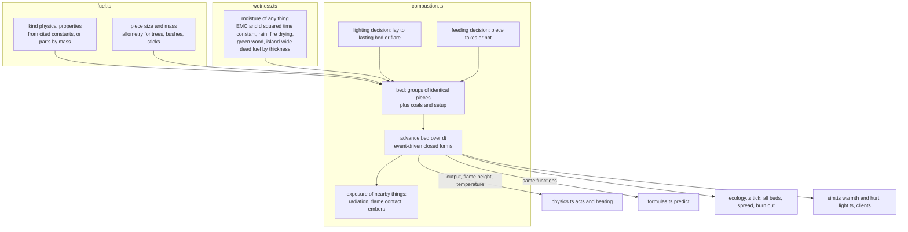

# feat: Fire from heat physics, with moisture in everything

## Overview

A fire stops being an hp countdown with setup factors. It becomes a bed of fuel pieces, and every piece lights, burns, keeps burning or goes out by heat-transfer formulas fixed from published measurements:
- Tinder, kindling and fuel each come with their own size and moisture.
- The ladder from tinder to logs, the lone log going out and banked coals all emerge from those formulas, with no rule for any of them.
- Everything that burns in the world (trees, grass, shelters) is the same kind of bed, and fire spreads by the heat that actually reaches things.
- Every material thing gets a physical moisture content.
- People learn fire-making from conditions cut where those formulas turn. The probes and the answer key take their truth from the same formulas.

## Problem Frame

Fire is the largest part of the sim that round five's rule (every outcome a formula of physical properties) has not reached:
- A catching spark makes a whole fire in one tick.
- Heat comes from the setup flags, not from what burns.
- Feeding always works, and wind does nothing.
- Burning world things run on a 0 to 1 ramp, and spread runs on a scorch counter.

Wetness exists only for held tinder and the island's litter. The operator chose fuel pieces in a bed, a size for each item, spread on the same physics now, and moisture in everything (see origin: docs/brainstorms/2026-10-07-fire-physics-requirements.md; brainstorm: docs/brainstorms/2026-10-07-fire-physics-brainstorm.md).

## Requirements Trace

**Fuel**
- R1. Each piece of fuel has its own size, taken from what it came from, and its mass follows from size and density. Items that differ in size don't stack as one. (U2)
- R2. Kinds carry physical burning and water properties, outside the 0 to 1 props. Made kinds take theirs from their parts by mass. (U1)

**The bed**
- R3. A fire is the set of pieces in it plus its coals, and its output, flames, warmth, light and heating all come from that set. (U4, U5, U8)
- R4 to R9. Lighting by contact and radiation, thin versus thick pieces, water first, burning by regression, staying alight by heat balance, radiation growing with fire size, wind and rain, char and coals. (U4)
- R10. A ring, a cover, blown air and charcoal act only through the physics. (U5)
- R11 to R13. Lighting is one act carrying the whole lay, feeding works on a bed that has outlasted its lighting, and outcomes are decided at the act's end. (U6)

**Fire around it**
- R14, R15. Spread by radiation, flame contact and embers, and whatever catches burns as a bed of its own pieces. (U7)

**Moisture**
- R16, R17. Moisture in every material thing: green wood, containers and roofs, the two existing wetnesses merged, the existing readers moved over. (U3)

**Learning and truth**
- R18 to R20. Conditions cut where the formulas turn, pieces chosen by theories, and formulas.ts predicting every fire outcome people cause. (U6, U9)

**Success criteria**
- The ladder from formulas alone, constants fixed from cited measurements, small versus big fires in wind and rain, outputs scaling with size, spread behaviour and moisture behaviour. (U4, U5, U7, U8, U3)
- The fire probes restaged and their claims re-based, and people coming to build lays small under large. (U10)
- The gate, whole worlds and bench. (U12)

## Scope Boundaries

- No smoke, air chemistry or flames as fluid flow. No temperature field over the map; heat moves only from burning things to what's near them (see origin).
- Sparks and friction keep their mechanics. What they make is an ember in the tinder of a lay.
- Talk about fires or places, and new wetness effects (food keeping, weight), come later.
- Carrying stays count-based: a log is one item, as now. Weight-based carrying is not in this plan.
- Places from memory (docs/brainstorms/2026-10-07-places-from-memory-requirements.md) is the next plan. Here a fire is still lit where its maker stands.

## Context & Research

### Relevant Code and Patterns

**Fire today**
- src/sim/physics.ts:
  - fireHeat, fireKind and fireHours;
  - sparkTick and rubTick, which make a whole fire on catching;
  - placing: light, feed, ring, cover, store;
  - heating thresholds;
  - applyRuling.
- src/sim/ecology.ts fire(): the hp tick, the burning ramp, scorch spread, dryness, flammability and burnOut.
- src/sim/wetness.ts: tinder and litter wetness, DAMP and SOAKED.

**Decide before doing (round five)**
- Verbs compute a pure Decision in physics.ts (joining, heating, placing), and the act applies it.
- src/sim/formulas.ts predict and predictMaterial ask the same decisions.
- The new bed physics follows this pattern as a pure module, as src/sim/seedling.ts and src/sim/wetness.ts already do.

**Items**
- A Stack is one item (src/sim/world.ts). count, counts, takeItems, giveItems and dropPile in src/sim/physics.ts all work by kind.
- Transfers (gift, trade, steal, repay, death, piles, store) lose per-item state today. Only Stack object moves (stash, unstash, wearIt) keep it.

**Kinds**
- src/sim/materials.ts: the Kind type, BASE, round and ensure (props clamp to 0 to 1, so physical quantities can't live in props), THING_MATERIAL and MADE_OF.
- Saved registries are frozen copies of BASE, so readers must fall back by `base` or `parts`.

**Sizes**
- src/terrain/flora.ts and src/sim/world.ts grown(): `size` is a tree's height, or a stick's or log's length. There is no thickness anywhere.
- space.ts shelves a tile only when every grown thing equals grown(), so per-thing state pins tiles.

**Readers of fire fields**
- src/sim/sim.ts: places, goals, needs warmth and hurt, flee.
- src/sim/light.ts, src/sim/brain.ts view, src/sim/inspect.ts.
- public/app.js firePower; demo/styles/isopixel/live.js flames.
- scripts/probes.ts, scripts/truth.ts, scripts/bench.ts.

**Loading**
- server.ts load() is the only loader of saves. It patches agents only, in the same-VERSION branch.

### Institutional Learnings

From .claude/napkin.md:
- **Formulas, not rules.** Every outcome comes of a formula, and people notice its inputs. Never add a rule switch or a failure text naming a cause. Give a new input a condition cut at the formula's edge, and take truth from formulas.ts.
- **The gate.** Run `bun scripts/evals.ts probes` and the worlds tier for any sim change, and commit the ledger file with the code it judged. Bump a tier's version when meanings change.
- **Speed work.** scripts/bench.ts before and after, with checksums.
- **Code style.** Static imports, no `any`, `import type`, plain-prose comments in the code's voice, Record for static tables. No em or en dashes anywhere.
- **VERSION.** The operator's standing rule this season: VERSION in src/sim/world.ts stays 17, and new state goes in optional fields. This overrides the napkin's general "bump VERSION for World shape changes".
- **Two models are a bug.** docs/research/learning-round5.md found fire learnable because each condition settles its outcome, while partial causes churn. Fire claims must be re-based on what a true-theory learner scores.

### External References

All constants come from docs/research/fire-constants.md, which carries a cited table per topic. Key picks:

**Lighting a piece**
- Tig 350 C for softwood and 305 C for hardwood.
- Apparent kρc 0.22 (kW/m2K)^2 s, times (1 + 8.1 m) for moisture.
- Critical flux 11 kW/m2 in the formula, with no lighting below 12.
- Thin and thick lighting times blended by Khan, de Ris and Ogden's interpolation.

**Burning**
- Flaming gives 13 MJ per kg of volatiles; char gives 30 MJ/kg, with a char yield of 0.25.
- Regression 0.028 q mm/min, up to about 1.6 in a bed.
- A piece keeps flaming while its gas comes off at 3.5 g/m2s or more, with L = 6.8 kJ/g.

**Flames**
- Flame height from Heskestad.
- κ 0.8 1/m for flame radiation, χr 0.3 radiant fraction.
- Contact heating of fine fuel about 100 kW/m2 in any visible flame.

**Moisture**
- Equilibrium moisture from Simard (1968).
- Drying time scales with the square of thickness, anchored on Nelson's 10-h stick (12.7 mm, 10 h).
- Each kg of water costs 2.6 MJ to drive off, and fine fuel above 30% moisture carries no flame.
- Green moisture by species from the Wood Handbook.

**Embers**
- Lofted to 12.2 times flame height and burned out by Albini's law.
- Whether one lights what it lands on: NFDRS probability of ignition, plus Manzello's results.

**People and fire**
- Pain from radiant heat by Purser's dose, and tenable up to 2.5 kW/m2.
- Light at 0.16 lm/W of flaming output, flagged as unverified.
- Temperatures: bonfire 600 to 900 C, bellows charcoal 1100 to 1300 C, copper melts at 1085 C, clay turns to ceramic from about 600 C.

Gaps the literature leaves are recorded as model gaps, not tuned: wind blow-off of small wood flames, luminous efficacy of wood flames, and measured kiln and banked-coal temperatures.

## Key Technical Decisions

- **Two new pure modules.** src/sim/fuel.ts holds kinds' physical properties, piece sizes and tree allometry. src/sim/combustion.ts holds the bed physics and the lighting and feeding decisions. physics.ts acts and formulas.ts predictions call the same functions, so act and prediction can never disagree. This mirrors seedling.ts.
- **A bed holds groups of identical pieces.** Each group records kind, thickness, length, moisture, count, absorbed heat, burnt depth and state. A tree's thousands of twigs are one group, so whole-tree burning stays cheap while the physics stays per piece.
- **Event-driven closed forms.**
  - Between events (a group lights, burns out or goes out), the flux each group receives is constant, so ignition progress and regression advance in closed form.
  - The act's first seconds (tinder) and long ticks use the same advance.
  - Each group keeps its absorbed heat across calls and ticks, so preheating from several sources accumulates.
- **No positions inside a bed.** Pieces in a bed are a heap. The radiation each group gets from the rest comes from the bed's flame (emissivity from flame thickness) and from burning neighbours, with a packing view factor that follows the crib correlations: a lone piece sees none. That packing assumption is what decides "one log goes out, three keep burning", and the crib literature anchors it (Anderson 1990: gaps over three thicknesses don't sustain). Giving each piece a position was rejected for now, for three reasons:
  - it needs a layout choice for every lay, and nothing people do chooses one;
  - it multiplies the view factors to compute;
  - the crib correlations already capture spacing for heaps as people pile them.

  If the lone-log or ladder criteria fail with the packing factor, positions are the first thing to revisit.
- **Constants fixed first.** Every constant is taken from docs/research/fire-constants.md before any success criterion is checked. A criterion that fails is reported as a model gap; the ladder must not hide in tuned numbers.
- **Physical moisture.**
  - Moisture content is on a dry basis (kg water per kg dry). Everything relaxes toward the Simard equilibrium for the air, with a time constant proportional to thickness squared.
  - Rain drives exposed things toward saturation, fire dries at net flux over 2.6 MJ/kg, and a roof or a rain-proof container blocks rain but not drying.
  - Living plants hold their species' green moisture, modulated by soil water. Anything cut or broken from them starts there.
  - Untouched grown dead fuel reads an island-wide moisture kept for a few reference thicknesses. This generalizes Weather.litter, so grown Things gain no field and tiles still shelve. A piece carries its own moisture once touched.
- **Sizes ride on Stacks, not kind ids.**
  - Stack gains an optional size, and moisture replaces `wet` in meaning, so recipes, plans, belief keys and incidents still count a stick as a stick.
  - Item piles of sized kinds keep their pieces (an optional pieces list on the pile Thing). Every transfer moves pieces rather than re-giving by kind.
  - Kinds without a size (stones, food) keep today's by-kind piles and merging.
- **Lighting carries its lay, decided at the act's end.**
  - The strike or rub act's inputs are the lay: tinder plus whatever kindling and fuel are set with it.
  - The ember goes into the tinder, and combustion.ts decides whether a lasting bed results and what it is.
  - Feeding is a place act on an existing bed, decided at the act's end too.
  - A carried flame (brand or lamp) set into a lay is the third way to light.
- **Spark and ember catching keep their formulas, re-expressed on physical moisture.** The catching moisture limits come from the cited ember-ignition data (NFDRS probability of ignition, Manzello), with the tinder's own flame then starting the climb by R4. Moisture therefore acts once per piece.
- **What fire gives people goes through their body's own terms.**
  - Warmth is the absorbed radiant flux (χr point source) entering as a rise in the person's operative temperature, through the existing cold formula, instead of a flat +0.9.
  - Hurt is Purser's dose above 2.5 kW/m2, replacing "burning above 0.4 within 2 m".
  - Light is luminous efficacy times flaming output.
- **Embers are random, from the seeded stream.** They draw from the world's seeded random stream, so runs replay, and formulas.ts doesn't predict spread (R20 covers only what people do).
- **No VERSION bump; probe tiers bump.** VERSION stays 17, and a load-time migration fills the new optional fields. The probes, worlds and live tiers of scripts/evals.ts bump their versions, because every fire meaning changes.
- **Coals are charcoal.** A spent fire's char is the charcoal kind. Once cooled it can be gathered, which links banked fires, kilns and forges physically.

## Open Questions

### Resolved During Planning

- **A young fire's first seconds inside a 5-minute tick:** event-driven closed forms, with each group's absorbed heat kept across calls and ticks.
- **Sized items stacking, moving and showing:** an optional size on Stack, kept out of kind ids. Piles keep pieces, transfers move pieces, and the UI groups by kind with a size summary.
- **Old saves:** a migration at load (U11) fills sizes and moisture, turns hp fires into beds and burning things into lit beds, gives saved kinds physical properties by base or parts, and turns old fire-making beliefs into lays.
- **Embers:** random from the seeded stream, with probability of ignition from NFDRS by moisture and temperature. Lofted to 12.2 times flame height, carried on the wind, burned out by Albini's law. Not predicted by formulas.ts.
- **Moisture for grown things:** derived when read (island-wide moisture by reference thickness for dead fuel, green moisture for living plants), and stored only once a thing is touched.
- **Condition cuts:**
  - "thick fuel" where the thin-to-thick transition falls for flame heating;
  - "small fire" where the bed's radiation to a thick piece falls below the critical flux;
  - "coals" when nothing is flaming;
  - "damp" and "soaked" at the spark and ember catching limits on physical moisture, and at fine fuel's 30% moisture of extinction for pieces in a lay.
- **Belief keys:** list a lay's kinds, with sizes as conditions. Experimenting proposes lays from what's held. The answer key samples lays from the island's own spread of piece sizes and moistures.
- **Hours left on a fire:** projected from the bed by the same closed forms.
- **Char:** it is the charcoal kind.
- **Brands and lamps:** a brand is a piece that burns down by R5. A lamp burns its fat at a wick rate derived from the fat's properties.

### Deferred to Implementation

- Published height-to-trunk-diameter and branch-size allometry per species group: the exact coefficients, cited in fuel.ts.
- The packing view factor's exact form within the crib anchors.
- The operative-temperature conversion into the existing warmth formula's units.
- How many reference thicknesses the island-wide dead-fuel moisture keeps (four, after the NFDRS classes, is the starting point).
- The constant in the Damköhler-style wind blow-off limit, kept within the cited anchors (0.5 to 1 m/s for a lone small piece, 2 to 3 m/s for a candle). It is reported as a model gap if the "small flame goes out in wind" criterion fails with it.
- Numerical tolerances for event detection, and how many events a single advance may process before yielding.

## High-Level Technical Design

> *This illustrates the intended approach and is directional guidance for review, not implementation specification. The implementing agent should treat it as context, not code to reproduce.*



Bed advance, per group of pieces (directional):

```text
flux on group  = contact (inside the flame) + radiation from flame (1 - exp(-0.8 L)) sigma T^4
                 + radiation from burning neighbours (packing view factor) + ring re-radiation
                 - losses (re-radiation at the surface temperature, convection by wind, rain sink)
unlit group    : absorbed heat += net flux x dt; lit when the surface reaches Tig
                 (thin and thick blended, moisture first)
burning group  : depth burnt += 0.028 x flux x dt (mm/min); goes out if (flux - losses)/L < 3.5 g/m2s;
                 char left = 0.25 of mass burnt
coals          : glow by Albini's air-supply law, hotter with wind or blown air; light kindling laid on
next event     = min(group lights, group burns out, group goes out, dt end)
```

## Implementation Units

### Phase 1: Matter

- [ ] **Unit 1: Physical properties of kinds**

**Goal:** Every flammable kind, natural or made, carries the physical quantities the formulas read, from cited constants or its parts by mass.

**Requirements:** R2; the success criterion that constants are fixed first.

**Dependencies:** None.

**Files:**
- Create: `src/sim/fuel.ts`
- Modify: `src/sim/materials.ts` (Kind gains an optional physical record beside fuel and burns; BASE values for stick, log, plank, bark, fiber, resin, fat, charcoal, and THING_MATERIAL for world things)
- Modify: `src/sim/physics.ts` (made kinds in forge, rub, join, heat, wet and applyRuling derive physical properties from their parts by mass)
- Test: `src/sim/fuel.test.ts`

**Approach:**
- Physical properties are kept beside `fuel` and `burns`, never in props, since round() and ensure() clamp props to 0 to 1:
  - density, kρc apparent and ambient conductivity;
  - lighting temperature and critical flux;
  - heat of flaming combustion and of char, and char yield;
  - regression coefficient and heat of gasification;
  - water uptake (maximum moisture) and green moisture;
  - species where it matters.
- Readers fall back by `base` for saved registries and by `parts` for made kinds. A kind with no flammable parts has none.
- Jev ruling kinds (`law:`) take theirs from their input parts.

**Patterns to follow:** fuel and burns on Kind; MADE_OF for world things; ensure()'s first-maker-wins.

**Test scenarios:**
- Happy path: stick, log, plank, bark, fiber, resin, fat and charcoal have every property, each matching docs/research/fire-constants.md.
- Happy path: a joined cord of fiber has fiber's properties by mass, and a tool of stick and stone has the stick's share.
- Edge case: a saved registry kind with no physical record reads BASE's by `base`.
- Edge case: a law kind takes its parts' properties.
- Edge case: a kind with no flammable part reads as not fuel.
- Error path: no property ever passes through round().

**Verification:** Every kind a fire could meet resolves physical properties, and the values trace to the constants document.

- [ ] **Unit 2: Every piece of fuel has its own size**

**Goal:** Sticks, logs, bark, fiber and other fuel carry thickness and length from what they came from, and keep them through every move.

**Requirements:** R1.

**Dependencies:** Unit 1.

**Files:**
- Modify: `src/sim/world.ts` (Stack gains an optional size; item pile Things gain optional pieces)
- Modify: `src/sim/fuel.ts` (allometry: trunk diameter from tree height by species group, branch and twig sizes, stick thickness from length and source, bark strip and fiber thickness)
- Modify: `src/sim/physics.ts`:
  - the inventory API, with piece-carrying give, take and drop;
  - felling and breaking, which give logs of the trunk's diameter and sticks of branch or twig size scaled by tree or bush size;
  - bark peeling, splitting, store placement, wear breaking into parts, and the rub act's stick.
- Modify: `src/sim/sim.ts` (pick_up, GATHER, give, trade, share_meal, beg, help, steal; agentDetail)
- Modify: `src/sim/groups.ts` (repay, share, takeShared)
- Modify: `src/sim/life.ts` (death drops keep pieces)
- Modify: `src/sim/ecology.ts` (loose sticks spawned with sizes; decay paths keep pieces)
- Test: `src/sim/fuel.test.ts`, `src/sim/materials.test.ts`, `src/sim/life.test.ts`

**Approach:**
- Size stays out of kind ids. The by-kind API remains for counting and planning.
- A piece-preserving pair (take a piece, give a piece) replaces takeItems followed by giveItems wherever an item changes hands or goes to a pile.
- Unsized kinds keep today's merging. A pile of a sized kind keeps its pieces, merges into a nearby pile of the same kind by appending pieces, and is picked up piece by piece.
- Grown sticks and fallen logs derive thickness from their scatter length and species. Nothing is stored on the grown Thing until it is taken, so shelving is unaffected.
- Carrying stays count-based.

**Patterns to follow:** stash and unstash and wearIt already move Stack objects intact; dropPile's 1 m merge.

**Test scenarios:**
- Happy path: felling a 15 m oak gives logs of a trunk diameter matching the allometry, and sticks thicker than those broken from a 1.5 m berry bush.
- Happy path: a stick given to another person, traded, stolen, dropped at death, piled and picked up keeps its size every time.
- Edge case: two sticks of different thickness dropped together form one pile holding two pieces, and picking up takes the pieces as they were.
- Edge case: stones still merge by kind into one pile of n (life.test.ts keeps n == 2).
- Edge case: a full inventory overflow sends the sized piece to a pile intact.
- Integration: a shelter built of sticks keeps its parts' sizes (needed by U7).

**Verification:** No path that moves a fuel item loses its size. Unsized items behave exactly as before.

- [ ] **Unit 3: Moisture in everything**

**Goal:** Every material thing has a physical moisture content that the weather, fire and shelter move, and today's tinder and litter wetness and their readers move onto it.

**Requirements:** R16, R17; the success criterion that everything has a moisture content.

**Dependencies:** Units 1 and 2 (thickness sets the time constant).

**Files:**
- Modify: `src/sim/wetness.ts` (becomes moisture for everything)
  - per-piece moisture relaxes toward the Simard equilibrium with τ = 10 h × (d / 12.7 mm)^2;
  - rain wets exposed pieces toward the kind's maximum moisture;
  - fire dries at net flux over 2.6 MJ/kg;
  - containers and roofs block rain only;
  - stores, worn clothing and piles update too, not just inventories.
- Modify: `src/sim/world.ts` (Stack moisture replaces `wet`'s meaning; Weather gains island-wide dead-fuel moisture by reference thickness, generalizing litter)
- Modify: `src/sim/air.ts` (relative humidity at a point, from the season's humidity in src/terrain/climate.ts and the sky)
- Modify: `src/sim/plants.ts` (a living plant's moisture from its species' green moisture and soil water)
- Modify: `src/sim/physics.ts` (sparkCatches and emberCatches read physical moisture, with limits from the cited ember-ignition data; cut or broken pieces start at the plant's moisture)
- Modify: `src/sim/sim.ts` (needs: the body's heat loss when wet through reads the moisture of what they wear, instead of rain with no roof)
- Modify: `src/sim/ecology.ts` (hourly moisture update)
- Test: `src/sim/wetness.test.ts` (new), `src/sim/materials.test.ts` (restated soak and dry tests), `src/sim/plan.test.ts` (SOAKED fiber case)

**Approach:**
- The island-wide dead-fuel moisture is updated hourly for a few reference thicknesses, with the same relaxation. An untouched grown stick or fallen log reads the value for its thickness, corrected for canopy shelter. Taking it gives the piece that moisture to carry from then on.
- DAMP and SOAKED become moisture values derived from the catching formulas, not 0 to 1 indices.

**Execution note:** Characterization first. Before changing them, record today's tinder soak and dry times (materials.test.ts) as the baseline the new physics is compared against in the test's comments.

**Patterns to follow:** wetness.ts's existing soak, dry and bag rules; litterHour's island-wide series; truth.ts reading it.

**Test scenarios:**
- Happy path: in rain with no roof, a 0.5 mm fiber reaches saturation within the hour, while a 10 cm log's moisture has barely moved.
- Happy path: after rain stops, thin fuel dries to equilibrium within hours, and logs take days.
- Happy path: a 13 mm stick's moisture covers about 63% of the way to a new equilibrium in about 10 hours.
- Happy path: under a roof or in a bag, held tinder takes no rain but still dries, faster by a fire.
- Happy path: a stick broken from a living tree starts at that species' green moisture and seasons over days.
- Edge case: equilibrium moisture rises with humidity and falls with temperature, per Simard's three humidity bands.
- Edge case: a grown stick that has never been touched leaves its tile shelvable.
- Integration: someone in soaked clothing loses heat faster than the same person dry, through the needs formula.

**Verification:** Every reader of wetness reads the one moisture. Probe staging still produces tinder as wet as the litter it was lying in.

### Phase 2: The bed

- [ ] **Unit 4: The bed physics**

**Goal:** A pure module that lights, burns, sustains and puts out groups of pieces by the cited formulas, and decides lightings and feedings.

**Requirements:** R3 to R9, R13; the ladder success criteria; small and big fires in wind and rain.

**Dependencies:** Units 1 to 3.

**Files:**
- Create: `src/sim/combustion.ts`
- Test: `src/sim/combustion.test.ts`

**Approach:**
- The bed is groups of identical pieces plus coals and setup.
- advance(bed, dt, weather at the bed) runs event to event, with constant flux between events.
- Bed output is the burning mass times the heat of combustion. Flame height comes from Heskestad, and flame radiation from emissivity over flame thickness.
- Each group's flux is contact (about 100 kW/m2 for fine fuel inside the flame) plus radiation from the flame and burning neighbours by the packing view factor, less losses.
- Lighting:
  - thin and thick times blended, with moisture factors;
  - nothing thick lights below 12 kW/m2;
  - water is driven off first at 2.6 MJ/kg.
- Burning: regression at 0.028 q mm/min, up to about 1.6. A group goes out below 3.5 g/m2s with L = 6.8 kJ/g.
- Char is 0.25 of the burnt mass. It glows by Albini's air-supply law and lights kindling laid on it.
- Wind blow-off uses a Damköhler-style limit within the cited anchors. Rain is a sink of 0.72 kW/m2 per mm/h.
- The decisions:
  - lighting(lay, conditions) gives the resulting bed if it keeps itself alight once its tinder is spent, else a spent flare;
  - feeding(bed, pieces, conditions) gives whether the pieces light before the bed's heat on them runs out.

**Execution note:** Implement test-first against the ladder criteria. They are written before any constant is set, from the constants document only.

**Technical design:** See High-Level Technical Design. Directional only.

**Patterns to follow:** src/sim/seedling.ts (a pure formula module run ahead and asked by formulas.ts); Decision values in physics.ts.

**Test scenarios:**
- Happy path, the ladder (each with dry fuel in still air):
  - tinder alone flares and leaves no bed;
  - tinder with twigs leaves a small burning bed;
  - a log laid on a lone tinder flame doesn't light;
  - three logs on a bed of burning sticks keep burning, while one log alone on the same start goes out once the sticks are spent;
  - kindling laid on four-hour-old coals lights.
- Happy path: a tinder-and-twigs flame goes out in wind that a bed of burning logs survives, and heavy rain puts out the small fire but not the big one.
- Edge case: twigs at 35% moisture don't carry flame, and at 10% they do.
- Edge case: a damp log takes longer to light than a dry one, by the moisture factor.
- Edge case: a group preheated by one burning piece and then another lights sooner than one heated only by the second.
- Edge case: an advance over 5 minutes and five advances over 1 minute give the same bed, within tolerance.
- Error path: an empty lay gives no bed; an unknown kind is not fuel.

**Verification:**
- Every success-criterion ladder case holds with constants copied from the document.
- Any that fails is written up as a model gap in the constants document and the plan's risks, not tuned.

- [ ] **Unit 5: Setups and heat through the physics**

**Goal:** A ring, a cover, blown air and charcoal change a fire only through the bed physics, and heating outcomes read temperatures the bed actually reaches.

**Requirements:** R3, R10; the success criterion that cooking, firing and forging scale with the fire.

**Dependencies:** Unit 4.

**Files:**
- Modify: `src/sim/combustion.ts`:
  - a ring cuts wind on the bed and adds re-radiation;
  - a cover limits air, so flames die and char forms or smoulders;
  - blown air raises burning rate up to the cited sixfold;
  - charcoal is a fuel;
  - bed and item temperatures come from an energy balance.
- Modify: `src/sim/physics.ts` (fireHeat gives way to the bed's temperature and flux; heating reads temperatures for cooking about 70 C internal, clay from about 600 C, softening copper 375 to 650 C, melting copper 1085 C, smelting about 1100 to 1200 C; fireKind names stay; placing ring and cover set the setup)
- Modify: `src/sim/formulas.ts` (predictMaterial builds a canonical bed for each place: an open fire of sticks and logs, a ringed hearth, a covered kiln, a forge with charcoal and blown air)
- Test: `src/sim/materials.test.ts` (setup tests restated in physical terms), `src/sim/combustion.test.ts`

**Approach:**
- A held item's temperature approaches the bed's at a rate set by its own thickness and properties, over the act's duration.
- Any heating outcome that becomes reachable or unreachable through the physics is reported in the unit's notes. For example, bonfire pottery firing is physically possible at an open fire.

**Patterns to follow:** heating() Decisions; predictMaterial's PLACES staging.

**Test scenarios:**
- Happy path: food set in a small open fire cooks.
- Happy path: clay held at arm's length over a small flame doesn't fire, while clay set in a hot bed for long enough does.
- Happy path: a covered kiln reaches a higher temperature than the same bed open, and wood in it chars to charcoal.
- Happy path: charcoal with blown air reaches smelting temperature, and the same charcoal without air doesn't.
- Edge case: a ring keeps a bed alight in wind that puts the same bed out unringed.
- Integration: formulas.ts's canonical hearth, kiln and forge give the same outcomes as the acts at those setups.

**Verification:** No fixed heat factor remains in physics.ts. Every heating outcome is a temperature comparison against the cited process temperatures.

- [ ] **Unit 6: Lighting with a lay, feeding, and choosing pieces**

**Goal:** People light fires by laying tinder, kindling and fuel and putting an ember or flame into it, feed beds that outlast their lighting, and choose which piece to lay by their theories.

**Requirements:** R11, R12, R13, R19.

**Dependencies:** Units 2 to 5.

**Files:**
- Modify: `src/sim/physics.ts` (sparkTick and rubTick take the lay as inputs and end with combustion's lighting decision; placing light sets a carried flame into a lay; feed uses the feeding decision; the bed lives on the fire Thing as an optional field)
- Modify: `src/sim/sim.ts` (the strike and rub acts carry lays; tinkerOptions and experiments propose lays from what's held; the piece taken is one no theory of theirs rules out, as doAct's plant fits chooses a spot; finishAct's fed_fire and onFireOut learn from beds)
- Modify: `src/sim/plan.ts` (make_fire's plan gathers what its lay needs; tend_fire reads hours left from the bed)
- Modify: `src/sim/beliefs.ts` (keys list a lay's kinds; the sentence for a lay)
- Test: `src/sim/plan.test.ts` (fire tests restated), `src/sim/garden.test.ts` (rub keys)

**Approach:**
- The key for a lay lists its kinds, as `strike|fiber+stick+stone|stone|stone|...` does today with inputs. Sizes are conditions.
- A spent flare is a failure with no cause in its text.
- A lit bed carries the owner as now. The act's outcome is decided when it ends, for the bed as it then stands.

**Patterns to follow:** doAct's plant fits (pieces by theories); round five's decide-then-apply verbs.

**Test scenarios:**
- Happy path: holding fiber and twigs in calm, dry air, a strike makes a fire that is still burning an hour later. Holding fiber alone, the strike's flare dies within the act and no fire is left.
- Happy path: a stick laid on a bed with an hour left lights, while a log laid on a dying flame doesn't.
- Happy path: kindling laid on coals relights the fire.
- Edge case: someone who holds a theory that thick fuel won't take on a small flame lays their thinnest stick instead.
- Edge case: a burning brand set into a lay of tinder and twigs lights it.
- Edge case: a lamp set into a log alone doesn't.
- Integration: experimenting with only tinder and logs proposes lays and comes to light a fire only once they hold something thinner.
- Integration: the make_fire plan gathers sticks when the only known lay needs them.

**Verification:** No path makes a whole fire without a lay deciding it. A failed lighting never names its cause.

### Phase 3: Fire in the world

- [ ] **Unit 7: Everything that burns, and spread, on the same physics**

**Goal:** Trees, grass, fallen wood and shelters burn as beds of their own pieces. What lies near any bed catches by radiation, flame contact and embers. The burning ramp and the scorch counter go.

**Requirements:** R14, R15; the spread success criteria.

**Dependencies:** Units 2 to 4.

**Files:**
- Modify: `src/sim/ecology.ts`:
  - fire() advances every bed;
  - a thing's exposure is radiation by the χr point source, flame contact within the wind-tilted flame (Thomas tilt), and embers;
  - absorbed heat on a target replaces scorch and cools when exposure stops;
  - a thing that lights becomes a bed;
  - burnOut happens when the bed is spent;
  - lightning lights a tree's fine fuel.
- Modify: `src/sim/combustion.ts` (beds for world things: a tree's foliage, twigs, branches and trunk from its size and species with green moisture; grass blades; a shelter's parts with their sizes; embers by output, lofted to 12.2 times flame height, carried by the wind, burned out by Albini's law, lighting with NFDRS probability from the seeded stream)
- Modify: `src/sim/world.ts` (optional bed and absorbed heat on Things)
- Modify: `src/sim/space.ts` (a thing carrying heat or a bed stays live until it cools; shelving otherwise unchanged)
- Test: `src/sim/fire.test.ts` (new)

**Approach:**
- The search radius around each bed comes from where its radiation falls below a negligible flux, derived from the formula rather than fixed, plus the wind-carried ember range.
- Hot things stay live; everything else shelves as before.

**Patterns to follow:** ecology.ts's per-tick loop over live things; the seeded Math.random stream (scripts/seeded.ts) for replayable chance.

**Test scenarios:**
- Happy path: in still air a 10 kW campfire never lights grass 2 m away, and grass touching its flames lights.
- Happy path: in a strong wind, dry grass downwind of a campfire can catch from flames or embers, and the same grass upwind doesn't.
- Happy path: a burning shelter lights a dry shelter 3 m downwind.
- Happy path: a lightning-struck tree in dry weather burns as a bed and leaves a burnt stump.
- Edge case: wet grass at 40% moisture doesn't catch from embers.
- Edge case: an exposed thing whose exposure ends cools and doesn't light later.
- Integration: a seeded world run replays the same spread exactly.

**Verification:** No burning ramp or scorch counter remains, and one bed model serves campfires and world fires.

- [ ] **Unit 8: What fire gives people, and how it shows**

**Goal:** Warmth, hurt, light, hours left and how fires look all follow from the bed's output.

**Requirements:** R3; the success criterion that warmth and light change with fire size.

**Dependencies:** Units 4 to 7.

**Files:**
- Modify: `src/sim/sim.ts` (needs: warmth from absorbed radiant flux as a rise in operative temperature, hurt from Purser's dose above 2.5 kW/m2; goals tend_fire and lay_by_wood from projected hours; flee from flux, not a burning threshold)
- Modify: `src/sim/light.ts` (fire lux from flaming output times luminous efficacy; coals glow dimly)
- Modify: `src/sim/brain.ts` (view text: wood for about N hours from the projection, plus the fire's size)
- Modify: `src/sim/inspect.ts` (rows for output, flame height, hours left and setup)
- Modify: `src/sim/physics.ts` (fireHours from the bed; nearFire by output)
- Modify: `public/app.js`, `demo/styles/isopixel/live.js` (flame size from flame height; glow from output)
- Test: `src/sim/light.test.ts` (restated), `src/sim/plan.test.ts` (tend_fire), a warmth case in `src/sim/fire.test.ts`

**Patterns to follow:** needs()'s existing feels-temperature path for warmth (sim.ts); light.ts's per-source lux falloff; inspect.ts's rows and bars; the renderers' existing firePower and flame-size hooks (public/app.js, demo/styles/isopixel/live.js).

**Approach:**
- The warmth conversion is one constant mapping absorbed W/m2 into the existing feels-temperature path (deferred: its exact value). It is checked against sunlight at 1000 W/m2 feeling warm.
- Wolves keep fleeing visible flames as now.

**Test scenarios:**
- Happy path: at 1.5 m a bigger fire warms more than a small one, and warmth falls with distance as one over distance squared.
- Happy path: someone standing in a blaze's 3 kW/m2 is hurt within the dose time, while someone at a campfire's edge isn't.
- Happy path: a big fire lights the dark further than coals do.
- Edge case: a bare fire Thing with no bed (old test fixtures) gives no warmth or light until migrated.
- Integration: tend_fire is offered when the projected hours fall below the hours to dawn.

**Verification:** No flat warmth, flat light or hp-based hours remain. The renderers draw flame size from the bed.

### Phase 4: Learning, truth and the gate

- [ ] **Unit 9: Conditions, predictions and the answer key**

**Goal:** People notice what decides fire outcomes, and formulas.ts predicts every fire outcome people cause from the same functions.

**Requirements:** R18, R20.

**Dependencies:** Units 4 to 6.

**Files:**
- Modify: `src/sim/sim.ts` (CONDITIONS gains thick fuel, small fire and coals; damp and soaked read each laid piece's physical moisture; conditionsNow for lighting, feeding and heating reads the lay and the bed)
- Modify: `src/sim/beliefs.ts` (WORDS and UNLESS for the new conditions)
- Modify: `src/sim/formulas.ts` (predict for lighting a lay, feeding a bed, and heating at a canonical bed; Situation gains the lay's pieces and the bed)
- Modify: `scripts/truth.ts` (stage lays by sampling the island's own piece sizes and moistures; verdicts like for like as now)
- Test: `src/sim/formulas.test.ts` (new: a cross-check that predict agrees with the acts' decisions on many sampled lays and beds, as round five's 39,147-combination check did for materials)

**Approach:** Each condition's cut comes from its formula's turning point, as the resolved questions say. Several conditions act together, so each one alone may only shift the odds (R18), and the probes are re-based accordingly in U10.

**Patterns to follow:** CONDITIONS' place and tinder entries (sim.ts); round five's predictMaterial cross-check; truth.ts's likeForLike with AFTER set-asides (thick fuel is judged within each fire size, as deep shade is set aside from shade).

**Test scenarios:**
- Happy path: predict and the act agree for every sampled lay of tinder, twigs, sticks and logs across moisture and wind.
- Happy path: conditionsNow for a log laid on a small flame includes thick fuel and small fire.
- Edge case: a lay whose tinder is soaked reports soaked on the tinder, not the logs.
- Integration: truth.ts's key for a fire way judges thick fuel as hurting when the island's lays show it.

**Verification:** The cross-check shows zero disagreements, and the answer key needs no trial runs.

- [ ] **Unit 10: Fire probes restaged and re-based**

**Goal:** Every fire probe stages lays, and its causes and claims are re-derived from formulas.ts and set against what a learner holding exactly the formula's cut conditions would score. A new probe checks that people come to build lays small under large.

**Requirements:** The success criteria on probes; R18.

**Dependencies:** Unit 9.

**Files:**
- Modify: `scripts/probes.ts`:
  - each probe's ways become lays (STONE, FLINT and RUB over tinder plus twigs, and sticks where it fits);
  - truth per person-hour from the lighting decision, as catchesNow does today;
  - each probe's causes re-derived, and each claim's threshold set relative to the true theory's score, computed per run;
  - a new probe that hands people tinder, twigs, sticks and logs, with claims that late lays put small fuel under large and that lasting fires rise from early to late.
- Modify: `scripts/evals.ts` (VERSION bumps to probes 6, worlds 6, live 6, with notes)
- Modify: `docs/design/charts.ts` (rows for the new probe)

**Approach:** docs/research/learning-round5.md section 2 computes what a true-theory learner scores. Each claim is restated as a share of that score, or as a gap from it, so no claim asks for more than the truth allows.

**Patterns to follow:** probes.ts's Case and judge machinery, and the truth record's pure and fails; the round-five choose fix (ways start alike); the debug copy used for the round-five findings, which computed the true theory's acc per person.

**Test scenarios:**
- Happy path: a smoke run of each restaged probe on two seeds gives truth with pure and fails reported, and the true theory scores at or above every claim's bar.
- Edge case: in the new probe, a learner who never adds kindling scores below the claim, and one holding exactly the true conditions passes.

**Verification:** No claim is unreachable by the true theory. The new probe's claims fail for a learner with no theories.

- [ ] **Unit 11: Load-time migration**

**Goal:** A save from before this change loads into the new physics without a version bump.

**Requirements:** The outstanding question on old saves; the operator's VERSION rule.

**Dependencies:** Units 1 to 8.

**Files:**
- Create: `src/sim/migrate.ts` (called once on load)
- Modify: `server.ts` (call it in the same-VERSION branch)
- Test: `src/sim/migrate.test.ts` (a fixture world in the old shape)

**Approach:** The migration fills in, in order:
1. Each lit fire's hp and charcoal become a bed whose projected hours equal its old hours left, made of sticks and logs of typical size, with charcoal as coals.
2. Burning things become lit beds, and scorch becomes absorbed heat.
3. Kinds lacking physical properties get them by base or parts.
4. Stacks of sized kinds get the kind's typical size, and `wet` converts to physical moisture.
5. Piles of sized kinds get pieces.
6. Fire-making beliefs whose inputs are tinder alone become lays of their tinder plus sticks, since every fire those people made did last. Their records are kept as they are.

**Patterns to follow:** server.ts load()'s same-VERSION patch branch; lazy `??=` defaults (journeys.ts, wetness.ts litter); beliefs.ts's rebuilding of an old record's mixes.

**Test scenarios:**
- Happy path: an old-shape world with a ringed fire at hp 200 loads into a bed whose projected hours match within tolerance.
- Happy path: an old belief `strike|fiber+stone|...` becomes a lay with sticks, and its record is unchanged.
- Edge case: a save that is already migrated is untouched by a second migration.
- Edge case: tinder at old wet 0.6 becomes soaked by the new cut.

**Verification:** The migrated fixture runs a day with no exceptions, and its people still make fires.

- [ ] **Unit 12: Bench, gate, whole worlds and docs**

**Goal:** The change is measured and judged as the repo requires, and its story is written down.

**Requirements:** The success criteria on the gate, whole worlds and the bench.

**Dependencies:** Units 1 to 11.

**Files:**
- Modify: `scripts/bench.ts` (add a spreading-fire workload)
- Modify: `DESIGN.md`, `docs/design/index.html`, `.claude/napkin.md`, `docs/research/fire-constants.md` (any model gaps found)
- Create: the `evals/*.json` ledger entries the gate writes

**Approach:**
- Run the bench before and after. Checksums change by design, so record timings and set a budget: a 20-day world no more than twice its round-five 8 s, with the spreading-fire workload reported.
- Run the probe gate on 20 seeds and the worlds tier on six islands. Both are new baselines under the bumped versions.
- Report whole-world survival, fires made, cold deaths and the planting numbers against round five's.
- Write up model gaps and whole-world shifts (fire harder to make, green wood, warmth by size).

**Test expectation:** none. This unit is measurement and documentation; the units above carry the tests.

**Verification:**
- The ledger entries are committed with the code they judged.
- The docs and charts are redrawn.
- The napkin gains the fire-physics guidance: one model of fire, constants from the document, conditions at the formulas' turning points.

## System-Wide Impact

- **Interaction graph.** Fire state is read by:
  - sim.ts: places, goals, needs, flee, the dark interrupt and heat options;
  - plan.ts: make_fire, tend_fire, lay_by_wood, contain_fire;
  - brain.ts view, inspect.ts, light.ts, animals.ts (wolves), groups.ts (talk by the fire);
  - formulas.ts;
  - scripts/probes.ts, scripts/truth.ts, scripts/bench.ts;
  - the two client renderers.

  Each moves to the bed accessors in U5 to U8.
- **State lifecycle risks.**
  - Per-piece state is lost on any transfer that re-gives by kind. U2 replaces every such path, and its tests cover each.
  - Grown things must not gain stored fields until touched, or tiles stop shelving.
  - Hot things stay live until cool.
- **Error propagation.**
  - combustion.ts is pure and deterministic. A non-finite or negative result (a zero thickness, a missing property) is treated as "not fuel" at the input boundary, so no bad value reaches the tick.
  - A bed that cannot be advanced goes out, with a trace entry for debugging, rather than throwing inside ecology's tick. A failed act stays a silent failure, as round five requires.
  - The migration validates each converted fire and stack. Anything it can't convert is left as the old shape and reported once in the server log, and readers treat an old-shape fire as out.
- **Integration coverage.** The predict-versus-act cross-check (U9), seeded replay of spread (U7), the migrated fixture (U11) and the probe smoke runs (U10) prove what unit tests alone can't.
- **Unchanged invariants.**
  - Kind ids, belief key format and recipes are unchanged. Sizes and moisture ride on Stacks.
  - VERSION stays 17.
  - Sparks and friction keep their blows and heat-up mechanics.
  - Unsized items merge and carry as before.
  - Everything outside fire, moisture and item moves is untouched.

## Risks & Dependencies

| Risk | Mitigation |
|------|------------|
| The ladder or the lone-log result fails with the cited constants | Constants are fixed before checking. A failure is recorded as a model gap (packing view factor, blow-off), and the operator decides whether to accept it or revisit the model, not quietly retune |
| Whole-world fires of many beds are slow | Groups of identical pieces, event-driven advance, a search radius from the formulas, and a bench budget with a spreading-fire workload |
| Fire becomes much harder to make, and cold deaths rise | Measured in whole worlds against round five. Old beliefs migrate to lays. Experimenting proposes lays. Green wood and moisture effects are reported as shifts to weigh, not hidden |
| Per-item state is lost on some transfer path | U2 enumerates every path from the infrastructure map and tests each. The by-kind API remains only for counts |
| Old saves load wrong | U11's fixture test, an idempotent migration, and running the live world only after the gate passes |
| The probes drift into measuring the change, not learning | U10 re-bases every claim on what a true-theory learner scores, and the new probe's claims must fail for a learner with no theories |
| Literature gaps (blow-off, luminous efficacy, kiln temperature) | Marked in docs/research/fire-constants.md and modelled from cited anchors. Their criteria are reported against the anchors |
| Clients misdraw fires without hp | U8 moves both renderers to flame height and output, and the migration fills beds before clients see them |

## Phased Delivery

- **Phase 1, matter (U1 to U3).** Properties, sizes and moisture land first with their tests. Fire still runs the old way, apart from tinder catching on physical moisture.
- **Phase 2, the bed (U4 to U6).** The new bed physics, the setups, and lighting and feeding.
- **Phase 3, fire in the world (U7, U8).** Spread, burning world things, warmth, light and the clients.
- **Phase 4, truth and the gate (U9 to U12).** Predictions, the answer key, restaged probes, migration, bench, gate, whole worlds and docs.

Each unit lands as its own commit on main with its tests passing. The probe gate and whole worlds run once on the finished tree (U12), since the probe meanings change wholesale and the version bump makes it a new baseline.

## Documentation / Operational Notes

- **Docs.**
  - DESIGN.md: the fire sections, the "No luck" paragraph, the weather and moisture sections, and a sixth-round bullet with numbers.
  - docs/design/index.html: the matching chapters and the charts.
  - .claude/napkin.md: a domain item for one model of fire and constants from the document.
- **The live world.** It loads through the migration on its next restart. Check its age through /api/debug/stats before restarting, as the napkin says. Never open :8095 to test.

## Sources & References

- **Origin document:** [docs/brainstorms/2026-10-07-fire-physics-requirements.md](docs/brainstorms/2026-10-07-fire-physics-requirements.md)
- Brainstorm: docs/brainstorms/2026-10-07-fire-physics-brainstorm.md
- Constants and citations: docs/research/fire-constants.md
- Round five findings: docs/research/learning-round5.md
- Related code: src/sim/physics.ts, src/sim/ecology.ts, src/sim/wetness.ts, src/sim/materials.ts, src/sim/world.ts, src/sim/formulas.ts, src/sim/sim.ts, scripts/probes.ts, scripts/truth.ts, server.ts
- Next plan: docs/brainstorms/2026-10-07-places-from-memory-requirements.md
