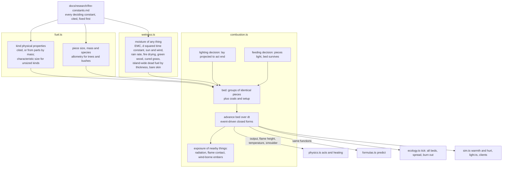

# feat: Fire from heat physics, with moisture in everything

## Overview

A fire stops being an hp countdown with setup factors. It becomes a bed of fuel pieces, and every piece lights, burns, keeps burning or goes out by heat-transfer formulas fixed from published measurements:
- Tinder, kindling and fuel each come with their own size, species and moisture.
- The ladder from tinder to logs, the lone log going out and banked coals all emerge from those formulas, with no rule for any of them.
- Everything that burns in the world (trees, grass, shelters) is the same kind of bed, and fire spreads by the heat that actually reaches things.
- Every material thing gets a physical moisture content.
- People learn fire-making from conditions cut where those formulas turn. The probes and the answer key take their truth from the same formulas.

## Problem Frame

Fire is the largest part of the sim that round five's rule (every outcome a formula of physical properties) has not reached:
- A catching spark makes a whole fire in one tick.
- Heat comes from the setup flags, not from what burns.
- Feeding always works, and wind does nothing.
- Burning world things run on a 0 to 1 ramp, and spread runs on a scorch counter.

Wetness exists only for held tinder and the island's litter. The operator chose fuel pieces in a bed, a size for each item, spread on the same physics now, and moisture in everything (see origin: docs/brainstorms/2026-10-07-fire-physics-requirements.md; brainstorm: docs/brainstorms/2026-10-07-fire-physics-brainstorm.md).

## Requirements Trace

**Fuel**
- R1. Each piece of fuel has its own size, taken from what it came from, and its mass follows from size and density. Items that differ in size don't stack as one. (U3)
- R2. Kinds carry physical burning and water properties, outside the 0 to 1 props. Made kinds take theirs from their parts by mass. (U1, U2)

**The bed**
- R3. A fire is the set of pieces in it plus its coals, and its output, flames, warmth, light and heating all come from that set. (U5, U6, U9)
- R4 to R9. Lighting by contact and radiation, thin versus thick pieces, water first, burning by regression, staying alight by heat balance, radiation growing with fire size, wind and rain, char and coals. (U5)
- R10. A ring, a cover, blown air and charcoal act only through the physics. (U6)
- R11 to R13. Lighting is one act carrying the whole lay, feeding works on a bed that has outlasted its lighting, and outcomes are decided before the act from the bed projected to its end. (U5, U7)

**Fire around it**
- R14, R15. Spread by radiation, flame contact and wind-borne embers, and whatever catches burns as a bed of its own pieces. (U8)

**Moisture**
- R16, R17. Moisture in every material thing: green wood and cured grass, containers and roofs, bare skin, the two existing wetnesses merged, the existing readers moved over. (U4)

**Learning and truth**
- R18. Conditions cut where the formulas turn. (U7, U10, U11)
- R19. Pieces chosen by theories. (U7)
- R20. formulas.ts predicts every fire outcome people cause. (U10)

**Success criteria**
- The ladder from formulas alone, constants fixed from cited measurements, small versus big fires in wind and rain, outputs scaling with size, spread behaviour and moisture behaviour. (U1, U4, U5, U6, U8, U9)
- The fire probes restaged and their claims re-based, and people coming to include small fuel with large. (U11)
- The gate, whole worlds and bench. (U4's phase gate, U13)

## Scope Boundaries

- No smoke, air chemistry or flames as fluid flow. No temperature field over the map; heat moves only from burning things to what's near them (see origin).
- Sparks and friction keep their mechanics. What they make is an ember in the tinder of a lay.
- Talk about fires or places, and new wetness effects (food keeping, weight), come later.
- Carrying stays count-based: a log is one item, as now. Weight-based carrying is not in this plan.
- Gathering a dead fire's charcoal is later work. A bed that has gone cold leaves ash, as big burnt things do today.
- Places from memory (docs/brainstorms/2026-10-07-places-from-memory-requirements.md) is the next plan. Here a fire is still lit where its maker stands.

## Context & Research

### Relevant Code and Patterns

**Fire today**
- src/sim/physics.ts:
  - fireHeat, fireKind and fireHours;
  - sparkTick and rubTick, which make a whole fire on catching;
  - placing: light, feed, ring, cover, store;
  - heating thresholds, including smoked food and smoke-cured leather under a cover, and melted resin;
  - enact, which makes brands and charcoal by kind;
  - applyRuling.
- src/sim/ecology.ts fire(): the hp tick, the burning ramp, scorch spread, dryness, flammability, burnOut, and the ruin drop of a shelter's parts by kind.
- src/sim/wetness.ts: tinder and litter wetness, DAMP and SOAKED, GROUND_TINDER.

**Decide before doing (round five)**
- Verbs compute a pure Decision in physics.ts (joining, heating, placing), and the act applies it.
- src/sim/formulas.ts predict and predictMaterial ask the same decisions.
- The new bed physics follows this pattern as a pure module, as src/sim/seedling.ts and src/sim/wetness.ts already do.

**Items**
- A Stack is one item (src/sim/world.ts). count, counts, takeItems, giveItems, dropPile and enact all work by kind.
- Transfers (gift, trade, steal, repay, death, piles, store, a ruined shelter's drop) lose per-item state today. Only Stack object moves (stash, unstash, wearIt) keep it.
- Structures keep parts as counts by kind (Thing.parts), added by place()'s build.

**Kinds**
- src/sim/materials.ts: the Kind type, BASE, round and ensure (props clamp to 0 to 1, so physical quantities can't live in props), THING_MATERIAL and MADE_OF.
- Saved registries are frozen copies of BASE, so readers must fall back by `base` or `parts`.
- Fern, hide and flower are flammable in BASE too.

**Sizes and the year**
- src/terrain/flora.ts and src/sim/world.ts grown(): `size` is a tree's height, or a stick's or log's length. There is no thickness anywhere.
- space.ts shelves a tile only when every grown thing equals grown(), so per-thing state pins tiles.
- A year is 40 days (src/sim/sky.ts).

**Warmth**
- src/sim/sim.ts needs():
  - cold is max(0, (12 - feels)/110), and mild reads air temperature;
  - a fire adds a flat +0.9 or +1.1;
  - warm_up adds a flat +0.6, and a lamp a flat +0.25;
  - rain with no roof chills 1.3 times.
- People start wearing nothing.

**Readers of fire fields and of burning**
- src/sim/sim.ts: places, goals, needs warmth and hurt, flee, strike targets, tinkerOptions, THING_PLACES filters.
- src/sim/ecology.ts: plants, nut and seed drops skip burning things.
- src/sim/light.ts, src/sim/brain.ts view, src/sim/inspect.ts, src/sim/animals.ts.
- public/app.js firePower, public/art.js burning tints.
- demo/styles/isopixel/live.js flames, demo/styles/isopixel/inspect.js.
- scripts/probes.ts, scripts/truth.ts, scripts/bench.ts.

**Loading**
- server.ts load() is the only loader of saves. It patches agents only, in the same-VERSION branch, and renames a save to .bak only on a version change.
- w.laws is indexed by belief key.

### Institutional Learnings

From .claude/napkin.md:
- **Formulas, not rules.** Every outcome comes of a formula, and people notice its inputs. Never add a rule switch or a failure text naming a cause. Give a new input a condition cut at the formula's edge, and take truth from formulas.ts.
- **The gate.** Run `bun scripts/evals.ts probes` and the worlds tier for any sim change, and commit the ledger file with the code it judged. Bump a tier's version when meanings change.
- **Speed work.** scripts/bench.ts before and after, with checksums.
- **Code style.** Static imports, no `any`, `import type`, plain-prose comments in the code's voice, Record for static tables. No em or en dashes anywhere.
- **VERSION.** The operator's standing rule this season: VERSION in src/sim/world.ts stays 17, and new state goes in optional fields. This overrides the napkin's general "bump VERSION for World shape changes".

From docs/research/learning-round5.md:
- Fire was learnable because each condition settled its outcome. Partial causes churn (crowding was formed 233 times and dropped 186), and nested conditions take each other's blame.
- Claims must be re-based on what a true-theory learner scores, and must still fail for a learner who learns nothing.

### External References

All constants come from docs/research/fire-constants.md, which carries a cited table per topic. Unit 1 completes it before any code. Key picks so far:

**Lighting a piece**
- Tig 350 C for softwood and 305 C for hardwood.
- Apparent kρc 0.22 (kW/m2K)^2 s.
- Critical flux 11 kW/m2 in the formula, with no lighting below 12.
- Thin and thick lighting times blended by Khan, de Ris and Ogden's interpolation. Moisture factors (1 + 5 m thin, 1 + 8.1 m thick) already carry the heat to boil the water off.

**Burning**
- Flaming gives 13 MJ per kg of volatiles; char gives 30 MJ/kg.
- Regression 0.028 q mm/min, up to about 1.6 in a bed.
- A piece keeps flaming while its gas comes off at 3.5 g/m2s or more. L and char yield are taken from the grain row Unit 1 fixes.

**Flames**
- Flame height from Heskestad.
- κ 0.8 1/m for flame radiation, χr 0.3 radiant fraction.
- Contact heating of about 100 kW/m2 for fine fuel, falling as the inverse square root of thickness for thicker pieces.

**Moisture**
- Equilibrium moisture from Simard (1968).
- Drying time scales with the square of thickness, anchored on Nelson's 10-h stick (12.7 mm, 10 h).
- 2.6 MJ to drive off each kg of water, when fire dries things and in the rain sink.
- Fine fuel above 30% moisture carries no flame.
- Green moisture by species from the Wood Handbook, and herbaceous curing from NFDRS.

**Wind-borne embers**
- Lofted to 12.2 times flame height and burned out by Albini's law.
- Whether one lights what it lands on: NFDRS probability of ignition, plus Manzello's results.

**People and fire**
- Pain from radiant heat by Purser's dose, and tenable up to 2.5 kW/m2.
- Light at 0.16 lm/W of flaming output, flagged as unverified.
- Temperatures: bonfire 600 to 900 C, bellows charcoal 1100 to 1300 C, copper melts at 1085 C, clay turns to ceramic from about 600 C.

Gaps are recorded as model gaps, not tuned: wind blow-off of small wood flames, luminous efficacy of wood flames, and measured kiln and banked-coal temperatures.

## Key Technical Decisions

- **Two new pure modules.** src/sim/fuel.ts holds kinds' physical properties, piece sizes, species and tree allometry. src/sim/combustion.ts holds the bed physics and the lighting and feeding decisions. physics.ts acts and formulas.ts predictions call the same functions, so act and prediction can never disagree. This mirrors seedling.ts.
- **A bed holds groups of identical pieces.** Each group records kind, species, thickness, length, moisture, count, absorbed heat, burnt depth and state. A tree's thousands of twigs are one group, so whole-tree burning stays cheap while the physics stays per piece.
- **Event-driven closed forms.**
  - Between events (a group lights, burns out or goes out), the flux each group receives is constant, so ignition progress and regression advance in closed form.
  - The act's first seconds (tinder) and long ticks use the same advance.
  - Each group keeps its absorbed heat across calls and ticks, so preheating from several sources accumulates.
- **No positions inside a bed.** Pieces in a bed are a heap, with geometry fixed in the constants document before any test runs:
  - the heap's footprint comes from its pieces' volume and a packing ratio;
  - each group's share of surface inside the flame comes from flame height against heap height;
  - the radiation it gets from burning neighbours comes through a packing view factor anchored on Anderson's three-thickness gap and Bamford's facing-panel view factor.

  Giving each piece a position was rejected for now, for three reasons: it needs a layout choice for every lay, which nothing people do makes; it multiplies the view factors to compute; and the crib correlations already capture spacing for heaps as people pile them. If the lone-log or ladder criteria fail, positions are the first thing to revisit.
- **Every deciding constant fixed first (Unit 1).** That covers the packing form, heap geometry, the blow-off constant, the wind profile, the allometry, the warmth conversion, the catching limits, rain rates, grain rows and process temperatures. All are written into docs/research/fire-constants.md with citations before any success criterion runs. A criterion that fails is a model gap; the ladder must not hide in tuned numbers.
- **The wind a bed feels.** A bed feels the wind at its own height, by the log wind profile over the ground's roughness, not head-height wind. Wind does three things, each through its own term:
  - feeds a flaming bed's burning through the air-supply term blown air uses;
  - cools fuel not yet alight;
  - blows off flames too small for it.
- **Physical moisture.**
  - Moisture content is on a dry basis (kg water per kg dry). Everything relaxes toward the Simard equilibrium for the air, with a time constant proportional to thickness squared, shortened by sun and wind.
  - Rain at the sky's rate drives exposed things toward the kind's maximum moisture, as does standing in water. Fire dries at net flux over 2.6 MJ/kg. A roof or a rain-proof container blocks rain but not drying.
  - Living plants hold their species' green moisture, modulated by soil water. Grass carries a cured share by the NFDRS herbaceous rule, and trees a dead-twig group, both at dead-fuel moisture. Anything cut or broken from a living plant starts green.
  - Untouched grown dead fuel reads an island-wide moisture kept for a few reference thicknesses. This generalizes Weather.litter, so grown Things gain no field and tiles still shelve. A piece carries its own moisture once touched.
  - Moisture lives in a new optional field. The migration converts and deletes the old `wet`, so a second migration finds nothing to convert.
  - With nothing worn, the body's own surface carries a moisture like any thin piece.
- **Sizes ride on Stacks, not kind ids.**
  - Stack gains optional size and species, so recipes, plans, belief keys and incidents still count a stick as a stick.
  - Item piles and structures of sized kinds keep their pieces (an optional pieces list beside count or parts). Every transfer, including enact's made pieces, moves pieces rather than re-giving by kind.
  - Unsized kinds keep today's by-kind piles, with a characteristic thickness and mass from fuel.ts for physics and one moisture per pile, merged by mass.
- **Lighting carries its lay, decided before the act.**
  - The strike or rub act's inputs are the lay: tinder plus whatever kindling and fuel are set with it, each kind listed as many times as it is laid.
  - combustion.ts decides from the lay followed until it goes out. The lighting lasts if everything laid with what the ember caught catches and burns through (restated at Unit 5 on the operator's call; it was "still alight when a feeding act begun at that moment would finish, DURATION.place later").
  - Feeding is a place act on an existing bed. It is decided the same way, and reports whether the laid pieces light and whether the bed survives taking them in.
  - A carried flame (brand or lamp) set into a lay is the third way to light. Brands and lamps burn down while carried.
- **Spark and ember catching keep their formulas, re-expressed on physical moisture.** The catching moisture limits and the gale that carries sparks off come from the cited data at a probability level and fuel temperature recorded in Unit 1. Moisture acts once per piece.
- **What fire gives people goes through their body's own terms.**
  - The absorbed radiant flux (χr point source) raises the person's operative temperature, and both the cold and the mild terms of needs() read it, so a fire can restore warmth as well as cancel loss.
  - warm_up's flat +0.6 and the lamp's flat +0.25 go.
  - Hurt is Purser's dose above 2.5 kW/m2.
  - Light is luminous efficacy times flaming output.
- **Wind-borne embers are random, from the seeded stream.** They draw from the world's seeded random stream, so runs replay, and formulas.ts doesn't predict spread (R20 covers only what people do). The ember in a lay is never random.
- **No VERSION bump; probe tiers bump.** VERSION stays 17, and a load-time migration fills the new optional fields after copying the save to a named backup. The probes, worlds and live tiers bump their versions after the phase 1 gate, because every fire meaning changes.
- **Char is the charcoal kind inside the bed.** It glows and relights kindling by its own properties. Gathering it from a cold fire is later work.

## Open Questions

### Resolved During Planning

- **A young fire's first seconds inside a 5-minute tick:** event-driven closed forms, with each group's absorbed heat kept across calls and ticks.
- **Which fire size a person sees for a bed that changes within an act:** the bed projected to the act's end, which is also what the decision reads.
- **Sized items stacking, moving and showing:** optional size and species on Stack, kept out of kind ids. Piles and structures keep pieces, transfers and enact move pieces, and the UI groups by kind with a size summary.
- **Old saves:** a migration at load (Unit 12), after a named backup.
- **Wind-borne embers:** random from the seeded stream, with probability of ignition from NFDRS by moisture and temperature. Lofted to 12.2 times flame height, carried on the wind, burned out by Albini's law. Not predicted by formulas.ts.
- **Moisture for grown things:** derived when read (island-wide moisture by reference thickness for dead fuel, green moisture and cured shares for living plants), and stored only once a thing is touched.
- **Whether sparks and friction keep their DAMP and GALE cut-offs, or move onto the bed physics:** spark and ember catching keep their own formulas on physical moisture, and the gale that carries sparks off stays. The tinder's flame then faces blow-off by the wind at bed height. Two physical stages each have their own turning point, and each gets its own condition.
- **Condition cuts:**
  - **thick fuel:** where a piece stops lighting before a tinder-and-twig flame is spent, from U5's lighting formula (not the thermal thin-to-thick transition, which falls near twig size);
  - **small fire:** where the bed's radiation to a thick piece falls below 12 kW/m2;
  - **coals:** when nothing is flaming;
  - **breezy:** where the bed-height wind blows off a bed at the small-fire boundary;
  - **gale:** where sparks are carried off, as now;
  - **damp and soaked tinder:** at the spark and ember catching limits;
  - **wet kindling:** at fine fuel's 30% moisture of extinction;
  - moisture of thick pieces only lengthens their lighting, and is judged through thick fuel and small fire.

  Nested conditions (soaked inside damp, gale inside breezy) are judged like for like, as AFTER sets deep shade aside from shade.
- **Belief keys:** list a lay's kinds, each as many times as it is laid, with sizes as conditions. Experimenting proposes lays from what's held. The answer key samples lays from the island's own spread of piece sizes, species and moistures.
- **Hours left on a fire:** projected from the bed by the same closed forms.
- **Char:** the charcoal kind inside the bed. Gathering it waits for later.
- **Brands and lamps:** a brand is a piece that burns down by R5 while carried, and a lamp burns its fat at a wick rate from the fat's cited properties.

### Deferred to Implementation

- Numerical tolerances for event detection, and when an advance should stop after many events.
- Which reference thicknesses the island-wide dead-fuel moisture keeps (four, after the NFDRS classes, is the starting point).
- How the UI summarises the sizes in a pile or a pack.

## High-Level Technical Design

> *This illustrates the intended approach and is directional guidance for review, not implementation specification. The implementing agent should treat it as context, not code to reproduce.*



Bed advance, per group of pieces (directional):

```text
flux on group  = contact (inside the flame: about 100 kW/m2 at fine fuel, scaling as d^-1/2)
                 + radiation from flame (1 - exp(-0.8 L)) sigma T^4
                 + radiation from burning neighbours (packing view factor) + ring and cover re-radiation
                 - losses (re-radiation at the surface temperature, convection by bed-height wind, rain sink)
unlit group    : absorbed heat += net flux x dt; lit when the surface reaches Tig
                 (thin and thick blended, moisture factor once)
burning group  : depth burnt += 0.028 x flux x dt (mm/min), raised by air supply (wind, blown air);
                 goes out if (flux - losses)/L < 3.5 g/m2s; char left by the fixed yield
coals          : glow by Albini's air-supply law, hotter with wind or blown air; light kindling laid on
bed            : out when nothing flames or glows; blown off when bed-height wind beats its flame
next event     = min(group lights, group burns out, group goes out, dt end)
```

## Implementation Units

### Phase 1: Constants and matter

- [x] **Unit 1: Complete and fix the constants**

**Goal:** Every constant that decides a success criterion is in docs/research/fire-constants.md, cited or marked as a gap, before any code reads it.

**Requirements:** The success criterion that constants are fixed first; R2's sources.

**Dependencies:** None.

**Files:**
- Modify: `docs/research/fire-constants.md`

**Approach:** Add cited rows, or rows marked as gaps, for:
- **Fuels:** resin, fat (with a lamp wick rate), bark, hide, fern and flower: burning and water properties.
- **Species:** density, green moisture and the softwood or hardwood row for each sim species (pine, oak, ash, aspen, hazel, heather, gorse, berry).
- **Unsized kinds:** thermal properties and a characteristic thickness and mass for clay, ore, metal, stone, food and hide.
- **Allometry:** trunk diameter from height, and branch and twig sizes, per species group.
- **Grain row:** which row of the Quintiere data a burning stick's side follows. L and char yield come from that row.
- **Bed geometry:** packing view factor form and the spacing it assumes, heap footprint from piece volume and packing ratio, and in-flame share from flame height.
- **Wind:** the profile to bed height, and the blow-off constant within the cited anchors.
- **Air supply:** the term for wind and blown air, from the crib-in-wind and Grumer data.
- **Catching:** the P(I) level and fuel temperature that set the deterministic spark and ember limits.
- **Rain:** rates in mm/h for the rain and storm skies, from src/terrain/climate.ts's seasonal precipitation over the hours the sky model rains.
- **Grass:** the herbaceous curing rule.
- **Temperatures:** for melting resin, smoking food and smoke-curing hide (the last two read the bed's smoulder state).
- **Warmth:** the conversion of absorbed flux to operative temperature, checked against sunlight.

Then run a throwaway check over a year of island weather. It reports the share of hours equilibrium tinder sits below the spark and ember limits, next to today's share of hours drier than DAMP, plus the seasoning time of the logs the allometry gives against the 40-day year. If either result means fire-making would mostly stop, the operator hears it before Unit 2 starts.

**Test expectation:** none. This unit is research; the check's results are recorded in the constants document.

**Verification:** Every constant the later units name resolves to a row with a citation or a marked gap. The humidity and seasoning results are written down.

- [x] **Unit 2: Physical properties of kinds**

**Goal:** Every kind, natural or made, carries the physical quantities the formulas read, from the constants document or its parts by mass.

**Requirements:** R2.

**Dependencies:** Unit 1.

**Files:**
- Create: `src/sim/fuel.ts`
- Modify: `src/sim/materials.ts` (Kind gains an optional physical record beside fuel and burns; BASE values for every base kind, including fern, hide and flower; THING_MATERIAL for world things)
- Modify: `src/sim/physics.ts` (made kinds in forge, rub, join, heat, wet and applyRuling derive physical properties from their parts by mass)
- Test: `src/sim/fuel.test.ts`

**Approach:**
- The physical record holds:
  - density, heat capacity, kρc apparent and ambient conductivity;
  - lighting temperature and critical flux;
  - heat of flaming combustion and of char, and char yield;
  - regression coefficient and heat of gasification;
  - maximum moisture and green moisture;
  - a characteristic thickness and mass for unsized kinds.
- Species-keyed values sit in fuel.ts by species, with one cited generic wood as the fallback.
- These are never in props, since round() and ensure() clamp props to 0 to 1.
- Readers fall back by `base` for saved registries and by `parts` for made kinds. Jev ruling kinds take theirs from their input parts.

**Patterns to follow:** fuel and burns on Kind; MADE_OF for world things; ensure()'s first-maker-wins.

**Test scenarios:**
- Happy path: every BASE kind has every property, each matching docs/research/fire-constants.md.
- Happy path: a joined cord of fiber has fiber's properties by mass, and a tool of stick and stone has each part's share by mass.
- Edge case: a saved registry kind with no physical record reads BASE's by `base`.
- Edge case: a law kind takes its parts' properties.
- Edge case: a stone has density and a characteristic thickness but no burning properties.
- Error path: no property ever passes through round().

**Verification:** Every kind a fire, moisture or heating could meet resolves physical properties traceable to the constants document.

- [x] **Unit 3: Every piece of fuel has its own size and species**

**Goal:** Sticks, logs, bark, fiber and other fuel carry thickness, length and species from what they came from, and keep them through every move, into structures and out of them.

**Requirements:** R1.

**Dependencies:** Unit 2.

**Files:**
- Modify: `src/sim/world.ts` (Stack gains optional size and species; item pile Things and structures gain optional pieces)
- Modify: `src/sim/fuel.ts` (allometry from Unit 1; stick thickness from length and source; bark strip and fiber thickness)
- Modify: `src/sim/physics.ts`:
  - the inventory API, with piece-carrying give, take and drop;
  - felling and breaking, which give logs of the trunk's diameter and sticks of branch or twig size by tree or bush size;
  - bark peeling, splitting;
  - enact's made pieces: a brand keeps its stick's size, and charcoal gets the wood's size less shrinkage;
  - store placement;
  - place()'s build, which appends pieces to a structure;
  - wear breaking into parts;
  - the rub act's stick.
- Modify: `src/sim/sim.ts` (pick_up, GATHER, give, trade, share_meal, beg, help, steal; agentDetail)
- Modify: `src/sim/groups.ts` (repay, share, takeShared)
- Modify: `src/sim/life.ts` (death drops keep pieces)
- Modify: `src/sim/ecology.ts` (loose sticks spawned with sizes; decay paths keep pieces; a ruined shelter drops its pieces)
- Test: `src/sim/fuel.test.ts`, `src/sim/materials.test.ts`, `src/sim/life.test.ts`

**Approach:**
- Size stays out of kind ids. The by-kind API remains for counting and planning.
- A piece-preserving pair (take a piece, give a piece) replaces takeItems followed by giveItems wherever an item changes hands or goes to a pile.
- Unsized kinds keep today's merging.
- A pile of a sized kind keeps its pieces, merges into a nearby pile of the same kind by appending pieces, and is picked up piece by piece.
- Grown sticks and fallen logs derive thickness from their scatter length and species. Nothing is stored on the grown Thing until it is taken, so shelving is unaffected.
- Carrying stays count-based.

**Patterns to follow:** stash, unstash and wearIt, which already move Stack objects intact; dropPile's 1 m merge.

**Test scenarios:**
- Happy path: felling a 15 m oak gives logs of the trunk diameter the allometry gives, from oak, and sticks thicker than those broken from a 1.5 m berry bush.
- Happy path: a stick given to another person, traded, stolen, dropped at death, piled and picked up keeps its size and species every time.
- Happy path: a shelter built of sticks keeps its pieces, and a ruined shelter drops them.
- Edge case: two sticks of different thickness dropped together form one pile holding two pieces, and picking up takes the pieces as they were.
- Edge case: stones still merge by kind into one pile of n (life.test.ts keeps n == 2).
- Edge case: a full inventory overflow sends the sized piece to a pile intact.
- Edge case: a brand made from a stick keeps the stick's size.

**Verification:** No path that moves a fuel item loses its size or species. Unsized items behave exactly as before.

- [x] **Unit 4: Moisture in everything, then the phase gate**

**Goal:** Every material thing has a physical moisture content that the weather, fire and shelter move. Today's tinder and litter wetness and their readers move onto it, and phase 1 is gated against round five's baselines.

**Requirements:** R16, R17; the success criterion that everything has a moisture content.

**Dependencies:** Units 1 to 3.

**Files:**
- Modify: `src/sim/wetness.ts` (moisture for everything)
  - per-piece moisture relaxes toward the Simard equilibrium with τ = 10 h × (d / 12.7 mm)^2, shortened by sun and wind;
  - rain at the sky's rate, and standing in water, drive things toward the kind's maximum moisture;
  - fire dries at net flux over 2.6 MJ/kg;
  - containers and roofs block rain only;
  - stores, worn clothing, piles, structures' pieces and bare skin update too.
- Modify: `src/sim/world.ts` (a new optional moisture field on Stacks, piles and pieces; Weather gains island-wide dead-fuel moisture by reference thickness, generalizing litter)
- Modify: `src/sim/air.ts` (relative humidity and rain rate at a point, from the season's humidity and precipitation in src/terrain/climate.ts and the sky)
- Modify: `src/sim/plants.ts` (a living plant's moisture from its species' green moisture and soil water; grass's cured share; a tree's dead-twig group)
- Modify: `src/sim/physics.ts` (sparkCatches and emberCatches read physical moisture at Unit 1's limits; cut or broken pieces start at the plant's moisture)
- Modify: `src/sim/sim.ts` (needs: the body's heat loss when wet through reads the moisture of what they wear, or of their skin if they wear nothing)
- Modify: `src/sim/ecology.ts` (hourly moisture update)
- Modify: `scripts/truth.ts`, `scripts/probes.ts` (read the new moisture where they read tinder wetness and litter)
- Test: `src/sim/wetness.test.ts` (new), `src/sim/materials.test.ts` (restated soak and dry tests), `src/sim/plan.test.ts` (the soaked fiber case)

**Approach:**
- The island-wide dead-fuel moisture is updated hourly for a few reference thicknesses with the same relaxation. An untouched grown stick, fallen log, grass's cured share or tree's dead twigs read the value for their thickness, corrected for canopy shelter. GROUND_TINDER reads it too, so grass has one moisture.
- DAMP and SOAKED become moisture values at the catching limits.
- When the unit lands, run the probe gate and the worlds tier at the current versions (probes 5, worlds 5). Fire still runs the old way, apart from catching on physical moisture. Commit the ledger entries with the code.

**Execution note:** Characterization first. Before changing them, record today's tinder soak and dry times (materials.test.ts) in the new test's comments as the baseline the physics is compared against.

**Patterns to follow:** wetness.ts's soak, dry and bag rules; litterHour's island-wide series; truth.ts reading it.

**Test scenarios:**
- Happy path: in rain with no roof, a 0.5 mm fiber reaches its kind's maximum moisture within the hour, while a 10 cm log's moisture has barely moved.
- Happy path: after rain stops, thin fuel dries to equilibrium within hours and logs take days, and a stick dries faster in sun and wind than in still shade.
- Happy path: a 13 mm stick's moisture covers about 63% of the way to a new equilibrium in about 10 hours.
- Happy path: under a roof or in a bag, held tinder takes no rain but still dries, faster by a fire.
- Happy path: a stick broken from a living tree starts at that species' green moisture and seasons over days.
- Happy path: tinder held through a dry day catches a spark.
- Edge case: equilibrium moisture rises with humidity and falls with temperature, per Simard's three humidity bands.
- Edge case: a grown stick that has never been touched leaves its tile shelvable.
- Integration: someone in soaked clothing loses heat faster than the same person dry, and an unclothed person in rain loses heat faster than in dry air.

**Verification:**
- Every reader of wetness reads the one moisture.
- Probe staging still produces tinder as wet as the litter it lay in.
- The phase gate's ledger entries are committed, and any regression is understood before phase 2 starts.

### Phase 2: The bed, and fire in the world (Units 5 to 9 land on main together)

- [x] **Unit 5: The bed physics**

**Goal:** A pure module that lights, burns, sustains and puts out groups of pieces by the cited formulas, and decides lightings and feedings.

**Requirements:** R3 to R9, R11 to R13; the ladder success criteria; small and big fires in wind and rain.

**Dependencies:** Units 1 to 4.

**Files:**
- Create: `src/sim/combustion.ts`
- Test: `src/sim/combustion.test.ts`

**Approach:**
- The bed is groups of identical pieces plus coals and setup, with the heap geometry from Unit 1.
- advance(bed, dt, weather at the bed) runs event to event.
- Output, flame height (Heskestad), flame radiation and each group's flux follow the design sketch:
  - contact flux scales with each piece's thickness;
  - moisture enters lighting once, through the cited factors;
  - wind at bed height feeds, cools and blows off through its three terms;
  - rain is a sink at the sky's rate.
- Char is left at the fixed yield. It glows by Albini's law and lights kindling laid on it.
- The decisions read the lay or bed projected to the act's end:
  - lighting(lay, conditions) lasts if everything laid with what the ember caught catches and burns through, else it is a spent flare (restated at Unit 5, see below);
  - feeding(bed, pieces, conditions) reports whether the pieces light before the bed's heat on them runs out, and whether the bed survives the heat they draw from it.

**Execution note:**
- Implement test-first against the ladder criteria, with every scenario's piece sizes, counts, wind and rain rate fixed beforehand from Unit 1:
  - the allometry for the island's commonest trees and bushes;
  - the island's median and gale bed-height winds;
  - its storm rain rate.
- No constant is coded until those tests exist.

**Technical design:** See High-Level Technical Design. Directional only.

**Patterns to follow:** src/sim/seedling.ts (a pure formula module run ahead and asked by formulas.ts); Decision values in physics.ts.

**Test scenarios:**
- Happy path, the ladder (each with dry fuel in still air, sizes from the allometry):
  - tinder alone flares and leaves no lasting bed;
  - tinder with twigs and finger-thick sticks lasts: the twigs and sticks catch and burn through (restated; it was "leaves a bed still alight when a feed would finish");
  - a log of a felled oak's trunk diameter laid on a lone tinder flame doesn't light;
  - three such logs on a bed of burning sticks keep burning, while one alone on the same start goes out once the sticks are spent;
  - kindling laid on the coals a log fire leaves once its flames are gone lights (restated; it was "on four-hour-old coals").
- Happy path: the gale leaves a tinder-and-twigs flame its twigs and blows a bed of logs' flames off; storm rain slows a burning bed and a small fire still lights and lasts in it (both restated; they were "at the median wind a tinder-and-twigs flame goes out that a bed of logs survives" and "at the storm rain rate the small fire goes out and the big one doesn't").
- Happy path: a bed of logs burns faster in a moderate wind than in still air.
- Happy path: soaked sticks laid on a small fire catch, later than the same sticks dry (restated; it was "soaked wood laid on a small fire puts it out, and the same wood dry feeds it").
- Edge case: twigs at 35% moisture don't carry flame, and at 10% they do.
- Edge case: a damp log takes longer to light than a dry one, by the moisture factor alone.
- Edge case: a group preheated by one burning piece and then another lights sooner than one heated only by the second.
- Edge case: an advance over 5 minutes and five advances over 1 minute give the same bed, within tolerance, for constant inputs.
- Error path: an empty lay gives no bed; an unknown kind or a zero thickness is not fuel.

**Verification:** Every ladder case holds with constants copied from the document. Any that fails is written up as a model gap in the constants document and the plan's risks, not tuned.

**Result (2026-10-08):** fails above tinder. Tinder flares and goes out, a log won't light on it, and the moisture, preheating and stepping cases hold; nothing thicker than tinder keeps a flame, so every rung from twigs up fails, with each alternative the constants document records. Written up in docs/research/fire-constants.md, section 28's Result and the gaps; the operator decides whether to accept it or revisit the model.

**Revisit (2026-10-08, operator's call):** the flame over what burns, groups lighting by their share in it, and lit wood burning at Heskestad's crib rate. Twigs now catch and burn through; the sticks, the timings (15 minutes alight, coals after hours), oak logs in still air and the median-wind blowout still fail. Constants document, section 28's "Result of the revision".

**Second revision (2026-10-08, operator's call):** a lay built from its heart outward with the flame reaching what touches the burning part, thick wood at Anderson's large-fuel rate beside other burning wood, and two cases restated (a lighting lasts when everything laid catches and burns through; the blowout case at the gale). The ladder now holds from tinder through sticks to three logs; a lone log on its own coals, four-hour coals, the gale, the storm, logs in wind after half an hour and soaked sticks still fail. Constants document, section 28's "Result of the second revision".

**Third revision (2026-10-08, operator's call):** coals as a compact bed at the heart (packing 0.5, char at its no-shrinkage density, 202.5 kg/m3 for generic wood, which charcoal's record now carries), glowing without widening the flame, and beside a thick piece only when they came from another shell; the storm, gale, soaked-feeding and coals cases restated to what the cited physics gives. All fourteen cases hold (constants document, section 28's "Result of the third revision"). Unit 5's tests pass as the phase 2 checkpoint.

- [x] **Unit 6: Setups and heat through the physics**

**Goal:** A ring, a cover, blown air and charcoal change a fire only through the bed physics. Heating outcomes read the temperature and state of the bed the item is actually in.

**Requirements:** R3, R10; the success criterion that cooking, firing and forging scale with the fire.

**Dependencies:** Unit 5.

**Files:**
- Modify: `src/sim/combustion.ts`:
  - a ring cuts the wind on the bed and adds re-radiation;
  - a cover limits air, so flames die and char forms or smoulders, and also holds heat in;
  - blown air raises burning through the air-supply term;
  - charcoal is a fuel;
  - the bed's temperature comes from its energy balance;
  - smouldering is a state.
- Modify: `src/sim/physics.ts`:
  - fireHeat gives way to the bed's temperature and state;
  - heating compares the bed's temperature where the item sits against the cited process temperatures: cooking, melting resin, firing clay, softening and melting copper, smelting;
  - smoked food and smoke-cured hide come from a smouldering covered bed;
  - fireKind names stay;
  - placing ring and cover set the setup.
- Modify: `src/sim/formulas.ts` (predictMaterial builds a canonical bed for each place only to stage the answer key; predictions read a real bed in Unit 10)
- Test: `src/sim/materials.test.ts` (setup tests restated in physical terms), `src/sim/combustion.test.ts`

**Approach:**
- An item takes the temperature the bed reaches where it sits. Thick items need the act's duration to come up to it, by their characteristic thickness from Unit 2.
- Any heating outcome that becomes reachable or unreachable through the physics is reported in the unit's notes. For example, bonfire pottery firing is physically possible at an open fire.

**Patterns to follow:** heating() Decisions; predictMaterial's PLACES staging.

**Test scenarios:**
- Happy path: food set in a small open fire cooks.
- Happy path: clay held at arm's length over a small flame doesn't fire, while clay set in a hot bed for long enough does.
- Happy path: a covered kiln reaches a higher temperature than the same bed open, wood in it chars to charcoal, and food in its smoulder is smoked.
- Happy path: charcoal with blown air reaches smelting temperature, and the same charcoal without air doesn't.
- Edge case: a ring keeps a bed alight in wind that puts the same bed out unringed.
- Edge case: a bed covered at dusk relights from kindling laid on its coals at dawn.
- Integration: the canonical hearth, kiln and forge give the same outcomes as acts at beds built the same way.

**Verification:** No fixed heat factor remains in physics.ts. Every heating outcome reads a bed temperature or state against a cited value.

**Result (2026-10-08):** section 29 of the constants document holds six readers' rows (R160 to R210) and the reading Unit 6 implements, written before its tests. The reading overturned two picks. A covered kiln runs cooler than the fire it covers, not hotter (29c), so that scenario is restated. Glowing char follows u^(1/8), not section 28's straight line (29d). What the physics now reaches or loses:
- Clay fires and copper softens in an open fire's flames or coals in any breeze, as bonfire pottery does (R43).
- Ore gives up copper only to coals with air blown in, ring or no ring.
- Three stones barely shelter a fire; a closed ring of about 25 keeps the usual lay alight in an 8 m/s wind.
- A stick chars under a cover in one heat act; a 17 cm log doesn't.
- Smoked food and smoke-cured hide come only from a covered bed whose wood smoulders, the hide hung 1.5 m over it.
- The usual lay heaped over smoulders about 11 hours. The dusk-to-dawn case is restated at the eighth hour.

The act's counts for ringing (three) and covering (six, or any clay) are kept as design. Not modelled: smoulder spreading into unlit wood under a cover (its radiation is under the 12 kW/m2 lighting limit), the ring stones' own heat-up, and a thin ash bank as a third cover state.

- [x] **Unit 7: Lighting with a lay, feeding, choosing pieces, and the conditions people notice**

**Goal:** People light fires by laying tinder, kindling and fuel and putting an ember or flame into it. They feed beds that outlast their lighting, choose pieces by their theories, and notice the conditions that decide all this.

**Requirements:** R11, R12, R13, R18, R19.

**Dependencies:** Units 3 to 6.

**Files:**
- Modify: `src/sim/physics.ts`:
  - sparkTick and rubTick take the lay as inputs and end with the lighting decision;
  - placing light sets a carried flame into a lay;
  - feed uses the feeding decision;
  - the bed lives on the fire Thing as an optional field;
  - carried brands and lamps burn down per tick.
- Modify: `src/sim/sim.ts`:
  - the strike and rub acts carry lays;
  - tinkerOptions and experiments propose lays from what's held;
  - the piece taken is one no theory of theirs rules out, as doAct's plant fits chooses a spot;
  - finishAct's fed_fire and onFireOut learn from beds;
  - CONDITIONS gains thick fuel, small fire, coals, breezy and wet kindling, and damp and soaked read the tinder's moisture;
  - conditionsNow for lighting, feeding and heating reads the projected lay and bed.
- Modify: `src/sim/plan.ts` (make_fire's plan gathers what its lay needs; tend_fire reads hours left from the bed)
- Modify: `src/sim/beliefs.ts` (keys list a lay's kinds as many times as laid; the sentence for a lay; WORDS and UNLESS for the new conditions)
- Modify: `src/sim/world.ts` (the optional bed on Things)
- Test: `src/sim/plan.test.ts` (fire tests restated), `src/sim/garden.test.ts` (rub keys)

**Approach:**
- The key for a lay lists its kinds, as `strike|fiber+stick+stick+stone|stone|stone|...` would. Sizes and moisture are conditions.
- A spent flare is a failure with no cause in its text.
- A lit bed carries the owner as now.

**Patterns to follow:** doAct's plant fits (pieces by theories); round five's decide-then-apply verbs; CONDITIONS' tinder entries.

**Test scenarios:**
- Happy path: holding fiber, twigs and finger-thick sticks in calm, dry air, a strike's lay catches and burns through. Holding fiber alone, the flare dies within the act.
- Happy path: a stick laid on a bed with an hour left lights, while a log laid on a dying flame doesn't.
- Happy path: kindling laid on coals relights the fire.
- Edge case: someone who holds a theory that thick fuel won't take on a small fire lays their thinnest stick instead.
- Edge case: a burning brand set into a lay of tinder and twigs lights it, while a brand carried too long has burned out.
- Edge case: a lamp set into a log alone doesn't light it.
- Edge case: conditionsNow for a log laid on a small fire includes thick fuel and small fire. A lay whose tinder is soaked reports soaked, not wet kindling.
- Integration: experimenting with only tinder and logs comes to light a fire only once they hold something thinner.
- Integration: the make_fire plan gathers sticks when the only known lay needs them.

**Verification:** No path makes a whole fire without a lay deciding it, a failed lighting never names its cause, and every new condition is cut at the turning point the resolved questions give.

- [x] **Unit 8: Everything that burns, and spread, on the same physics**

**Goal:** Trees, grass, fallen wood and shelters burn as beds of their own pieces. What lies near any bed catches by radiation, flame contact and wind-borne embers. The burning ramp and the scorch counter go.

**Requirements:** R14, R15; the spread success criteria.

**Dependencies:** Units 3 to 5.

**Files:**
- Modify: `src/sim/ecology.ts`:
  - fire() advances every bed;
  - a thing's exposure is radiation by the χr point source, flame contact within the wind-tilted flame (Thomas tilt), and wind-borne embers;
  - absorbed heat on a target replaces scorch and cools when exposure stops;
  - a thing that lights becomes a bed;
  - a bed gone cold leaves ash;
  - lightning lights a tree's dead twigs;
  - the plants loop and nut and seed drops read the bed instead of burning.
- Modify: `src/sim/combustion.ts` (beds for world things: a tree's foliage, dead twigs, branches and trunk from its size and species; grass's cured and green blades; a shelter's pieces; wind-borne embers by output, lofted to 12.2 times flame height, carried by the wind, burned out by Albini's law, lighting with NFDRS probability from the seeded stream)
- Modify: `src/sim/sim.ts` (THING_PLACES filters, spot("fire"), strike targets, tinkerOptions and flee read beds instead of burning)
- Modify: `src/sim/world.ts` (optional absorbed heat on Things)
- Modify: `src/sim/space.ts` (a thing carrying heat or a bed stays live until it cools; shelving otherwise unchanged)
- Test: `src/sim/fire.test.ts` (new)

**Approach:** The search radius around each bed comes from where its radiation falls below a negligible flux, derived from the formula rather than fixed, plus the wind-borne ember range. Hot things stay live; everything else shelves as before.

**Patterns to follow:** ecology.ts's per-tick loop over live things; the seeded Math.random stream (scripts/seeded.ts) for replayable chance.

**Test scenarios:**
- Happy path: in still air a 10 kW campfire never lights grass 2 m away, and grass touching its flames lights.
- Happy path: in a strong wind, cured grass downwind of a campfire can catch from flames or embers, and the same grass upwind doesn't.
- Happy path: a burning shelter lights a dry shelter 3 m downwind.
- Happy path: a lightning-struck tree in dry weather burns as a bed and leaves a burnt stump.
- Edge case: grass at 40% moisture doesn't catch from embers.
- Edge case: an exposed thing whose exposure ends cools and doesn't light later.
- Integration: a seeded world run replays the same spread exactly.

**Verification:** No burning ramp or scorch counter remains, and no reader of `burning` is left. One bed model serves campfires and world fires.

- [x] **Unit 9: What fire gives people, and how it shows**

**Goal:** Warmth, hurt, light, hours left and how fires look all follow from the bed's output.

**Requirements:** R3; the success criterion that warmth and light change with fire size.

**Dependencies:** Units 5 to 8.

**Files:**
- Modify: `src/sim/sim.ts` (needs: absorbed radiant flux raises operative temperature for both the cold and mild terms; warm_up's flat +0.6 and the lamp's flat +0.25 go; hurt from Purser's dose above 2.5 kW/m2; tend_fire and lay_by_wood from projected hours; flee from flux)
- Modify: `src/sim/light.ts` (fire and lamp lux from flaming output times luminous efficacy; coals glow dimly; LAMP_LUX goes)
- Modify: `src/sim/brain.ts` (view text: wood for about N hours from the projection, plus the fire's size)
- Modify: `src/sim/inspect.ts` (rows for output, flame height, hours left and setup)
- Modify: `src/sim/physics.ts` (fireHours from the bed; nearFire by output)
- Modify: `public/app.js`, `public/art.js`, `demo/styles/isopixel/live.js`, `demo/styles/isopixel/inspect.js` (flame size and tint from the bed)
- Test: `src/sim/light.test.ts` (restated), `src/sim/plan.test.ts` (tend_fire), warmth cases in `src/sim/fire.test.ts`

**Approach:** The warmth conversion is Unit 1's. Wolves keep fleeing fires as now.

**Patterns to follow:** needs()'s feels-temperature path; light.ts's per-source lux falloff; inspect.ts's rows and bars; the renderers' existing flame hooks.

**Test scenarios:**
- Happy path: someone cold sitting 1.5 m from a fire warms back up, more by a bigger fire, and warmth falls with distance as one over distance squared.
- Happy path: someone standing in a blaze's 3 kW/m2 is hurt within the dose time, while someone at a campfire's edge isn't.
- Happy path: a big fire lights the dark further than coals do, and a lamp's light follows its output.
- Edge case: a bare fire Thing with no bed (old test fixtures) gives no warmth or light until migrated.
- Integration: tend_fire is offered when the projected hours fall below the hours to dawn.

**Verification:** No flat warmth, flat light or hp-based hours remain. The renderers draw flame size from the bed.

### Phase 3: Truth and the gate

- [x] **Unit 10: Predictions and the answer key**

**Goal:** formulas.ts predicts every fire outcome people cause from the same functions and the real bed. The answer key stages them from the island's own fuel.

**Requirements:** R20, R18.

**Dependencies:** Units 5 to 7.

**Files:**
- Modify: `src/sim/formulas.ts` (predict for lighting a lay, feeding a bed and heating at the Situation's bed; Situation gains the lay's pieces, the bed, rain rate and air temperature)
- Modify: `scripts/truth.ts` (stage lays by sampling the island's own piece sizes, species and moistures; stage heating ways at beds sampled from the fires people keep; verdicts like for like as now)
- Test: `src/sim/formulas.test.ts` (new: predict agrees with the acts' decisions on many sampled lays, beds and heatings, as round five's 39,147-combination check did for materials)

**Patterns to follow:** CONDITIONS' place and tinder entries; round five's predictMaterial cross-check; truth.ts's likeForLike with AFTER set-asides (thick fuel is judged within each fire size, as deep shade is set aside from shade).

**Test scenarios:**
- Happy path: predict and the act agree for every sampled lay across moisture, wind and rain.
- Happy path: predict and the act agree for heating at every sampled bed.
- Integration: truth.ts's key for a fire way judges thick fuel as hurting when the island's lays show it.

**Verification:** The cross-check shows zero disagreements, and the answer key needs no trial runs.

- [x] **Unit 11: Fire probes restaged and re-based**

**Goal:** Every fire probe stages lays, and its causes and claims are re-derived from formulas.ts. Each claim sits between what a learner with no theories scores and what a learner holding exactly the true conditions scores. A new probe checks that people come to include small fuel with large.

**Requirements:** The success criteria on probes; R18.

**Dependencies:** Unit 10.

**Files:**
- Modify: `scripts/probes.ts`:
  - each probe's ways become lays;
  - truth per person-hour from the lighting decision;
  - causes re-derived;
  - each claim's bar set per run between the no-theory learner's score and the true theory's;
  - a churn metric per cause (theories formed and dropped per person, as docs/research/learning-round5.md section 3 counts them);
  - the new probe hands people tinder, twigs, sticks and logs, and claims that the share of late lays holding pieces thinner than the thick-fuel cut alongside thick ones rises from early to late, as lasting fires do.
- Modify: `scripts/evals.ts` (VERSION bumps to probes 6, worlds 6, live 6, with notes)
- Modify: `docs/design/charts.ts` (rows for the new probe)

**Approach:** docs/research/learning-round5.md section 2 computes the true theory's score. Each claim is restated against it, and is checked to fail for a learner with no theories.

**Patterns to follow:** probes.ts's Case and judge machinery and the truth record; the round-five choose fix (ways start alike); the debug copy used for the round-five findings, which computed the true theory's accuracy per person.

**Test scenarios:**
- Happy path: a smoke run of each restaged probe on two seeds gives truth with pure and fails reported, and the true theory scores at or above every claim's bar.
- Error path: every restaged claim fails for a learner with no theories.
- Edge case: in the new probe, a learner who never adds kindling scores below the claim, and one holding exactly the true conditions passes.

**Verification:** No claim is unreachable by the true theory, and none is met by learning nothing. Churn is reported beside the claims.

**Result (2026-10-09):** restaged; on seeds 1 and 2 every fire probe's truth is pure (1.0), the causes derived from the cases match the staged ones (the wind with its breeze, which comes with it in the probe sky), and no claim is unreachable or free.
- Tinder held bare in the open takes up the night's damp air (0.07 by day, 0.25 by night in a dry sky), and tinder rained on stays damp about nine hours against the body. Under the old sky, raining 35% of hours, it was damp 98% of hours. So probe people wear a hide, keeping what they hold against them as wetness.ts models, and rain comes one hour in twenty, or at night three in ten and by day one in fifty. Blame now fails 14 to 23% of hours, two 60 to 69%, except 30 to 36%.
- Kindle's truth is the lays people made, each judged by the act. Thick wood is the derived cause; people form that theory within about six hours, so 95% of first-third lays are already thin.
- Truthward and unsuperstitious are dropped: learning nothing meets them. A learning claim (late against early) is held only against learning nothing, since a learner holding the true theory from the start has nothing to learn.

- [x] **Unit 12: Load-time migration**

**Goal:** A save from before this change loads into the new physics without a version bump, and can be rolled back.

**Requirements:** The origin's question on old saves; the operator's VERSION rule.

**Dependencies:** Units 2 to 9.

**Files:**
- Create: `src/sim/migrate.ts` (called once on load)
- Modify: `server.ts` (copy world.json to a named backup, then call the migration in the same-VERSION branch)
- Test: `src/sim/migrate.test.ts` (a fixture world in the old shape)

**Approach:** The migration fills in, in order:
1. Each lit fire's hp and charcoal become a bed whose projected hours match its old hours left, made of sticks and logs of typical size, with charcoal as coals. Where no such bed matches within tolerance, the closest is used and reported.
2. Burning things become lit beds, and scorch becomes absorbed heat.
3. Kinds lacking physical properties get them by base or parts.
4. Stacks, piles and structures of sized kinds get typical sizes and pieces. `wet` converts into the new moisture field and is deleted.
5. Fire-making beliefs become lays. A strike belief with tinder alone gets tinder plus sticks. A rub belief, whose key names two sticks and no tinder, gets its sticks plus tinder.
   - Their theories are kept and their records cleared, as beliefs.ts teach clears a taught belief, since their wins were earned under the old physics.
   - Their w.laws entries, plan steps and watching progress move to the new keys.

**Patterns to follow:** server.ts load()'s same-VERSION patch branch and its .bak rename; lazy `??=` defaults (journeys.ts, wetness.ts litter); beliefs.ts teach.

**Test scenarios:**
- Happy path: an old-shape world with a ringed fire at hp 200 loads into a bed whose projected hours match within tolerance.
- Happy path: an old belief `strike|fiber+stone|...` becomes a lay with sticks, keeps its theories, and its next lighting logs no new law.
- Edge case: a save that is already migrated is untouched by a second migration.
- Edge case: tinder at old wet 0.6 becomes soaked by the new cut.
- Edge case: the backup is written before the first migrated save.

**Verification:** The migrated fixture runs a day with no exceptions, and its people still make fires.

- [x] **Unit 13: Bench, gate, whole worlds and docs**

**Goal:** The change is measured and judged as the repo requires, and its story is written down.

**Requirements:** The success criteria on the gate, whole worlds and the bench.

**Dependencies:** Units 1 to 12.

**Files:**
- Modify: `scripts/bench.ts` (add a spreading-fire workload)
- Modify: `DESIGN.md`, `docs/design/index.html`, `.claude/napkin.md`, `docs/research/fire-constants.md` (any model gaps found)
- Create: the `evals/*.json` ledger entries the gate writes

**Approach:**
- Run the bench before and after. Checksums change by design, so record timings and set a budget: a 20-day world no more than twice its round-five 8 s, with the spreading-fire workload also within budget.
- Run the probe gate on 20 seeds and the worlds tier on six islands. Both are new baselines under the bumped versions.
- Report against round five:
  - whole-world survival, fires made and cold deaths;
  - how often lightings fail to the wind;
  - log seasoning;
  - the planting numbers.
- Write up model gaps and whole-world shifts: fire harder to make, green wood, warmth by size.

**Test expectation:** none. This unit is measurement and documentation; the units above carry the tests.

**Verification:**
- The ledger entries are committed with the code they judged.
- The docs and charts are redrawn.
- The napkin gains the fire-physics guidance: one model of fire, constants from the document, conditions at the formulas' turning points.

**Result (2026-10-09):** the gate on twenty seeds is the probes 6 baseline (57b9da5): every fire probe's claims hold, kindle's too, and the planting probes leave the 16 claims round five left open. Whole worlds, six islands over 60 days, are the worlds 6 baseline (458dc46). Against round five, replayed with deaths recorded:
- Nobody makes a fire, against 55 fires on all six islands. People try lays, but tinder held bare is damp or soaked nearly always under a sky that rains in 47% of hours. Twenty of 21 struck lays failed in damp tinder, none to a gale; 15 of 16 rubbed made an ember the tinder wouldn't take; one caught and flared out over an 18 mm stick of green wood. This is the risk Unit 1 reported, written into the constants document's gaps, not tuned.
- 63% of people survive (70%); cold kills 11 and hunger 1 (10 and 5), and no death was a mislabelled burn. 154 plantings went in and 61% came up (171 and 68%).
- Log seasoning: three in four pieces of wood people hold are green (median water 0.67 to 0.72); one in ten is seasoned below 20%.
- Bench: 20 days of a world take 7.2 s (8 s in round five; the budget is 16 s). The spreading grass fire takes 13 s, 9 s of it growing the island.

## System-Wide Impact

- **Interaction graph.** Fire state and burning are read by:
  - sim.ts: places, goals, needs, flee, strike targets, tinkerOptions, the dark interrupt and heat options;
  - plan.ts: make_fire, tend_fire, lay_by_wood, contain_fire;
  - ecology.ts: plants, nut and seed drops;
  - brain.ts view, inspect.ts, light.ts, animals.ts (wolves), groups.ts (talk by the fire);
  - formulas.ts;
  - scripts/probes.ts, scripts/truth.ts, scripts/bench.ts;
  - public/app.js, public/art.js and the isopixel renderer and inspector.

  Each moves to the bed accessors in Units 6 to 9.
- **State lifecycle risks.**
  - Per-piece state is lost on any transfer that re-gives by kind. Unit 3 replaces every such path, enact and the ruin drop included, and its tests cover each.
  - Grown things must not gain stored fields until touched, or tiles stop shelving.
  - Hot things stay live until cool.
- **Error propagation.**
  - combustion.ts is pure and deterministic. A non-finite or negative input (a zero thickness, a missing property) is treated as "not fuel" at the input boundary, so no bad value reaches the tick.
  - A bed that cannot be advanced goes out, with a trace entry for debugging, rather than throwing inside ecology's tick. A failed act stays a silent failure, as round five requires.
  - The migration validates each converted fire and stack. Anything it can't convert is left as the old shape and reported once in the server log, and readers treat an old-shape fire as out.
- **Integration coverage.** These prove what unit tests alone can't:
  - the predict-versus-act cross-check over lays, beds and heating (Unit 10);
  - seeded replay of spread (Unit 8);
  - the migrated fixture (Unit 12);
  - the probe smoke runs with floor and ceiling (Unit 11).
- **Unchanged invariants.**
  - Kind ids, the belief key format and recipes are unchanged. Sizes, species and moisture ride on Stacks.
  - VERSION stays 17.
  - Sparks and friction keep their blows and heat-up mechanics.
  - Unsized items merge and carry as before.
  - Everything outside fire, moisture, warmth and item moves is untouched.

## Risks & Dependencies

| Risk | Mitigation |
|------|------------|
| The ladder or the lone-log result fails with the cited constants | Every deciding constant is fixed in Unit 1 before tests run, and test sizes come from the allometry. A failure is recorded as a model gap (packing, blow-off, grain row), and the operator decides whether to accept it or revisit the model, never quietly retune. Happened at Unit 5 (2026-10-08): the heap's width, groups lighting all at once and the burning balance together keep any wood from holding a flame (constants document, section 28's Result) |
| Island humidity keeps tinder too wet to catch most hours | Unit 1's year-of-weather check reports it before any code, with drying by fire, sun and the body as the physical routes people have |
| Logs at trunk diameter barely season within the 40-day year | Unit 1's check reports seasoning times. Splitting (planks) and thinner branches are physical answers people can learn, and whole worlds report it |
| Most open-air lightings blow out | Bed-height wind by the log profile, not head height. Unit 13 reports how often lightings fail to the wind |
| Whole-world fires of many beds are slow, and the ember range stocks far tiles | Groups of identical pieces, event-driven advance, search radii from the formulas, hot-only liveness, and a bench budget covering a spreading-fire workload |
| Fire becomes much harder to make, and cold deaths rise | Measured in whole worlds against round five. Warmth can restore as well as cancel loss. Old beliefs migrate to lays. Experimenting proposes lays |
| Per-item state is lost on some transfer path | Unit 3 enumerates every path from the infrastructure map, enact and ruins included, and tests each |
| Old saves load wrong, or a revert damages the live world | A named backup before the first migrated save, a separate moisture field, Unit 12's fixture test, an idempotent migration, and restarting the live world only after the gate passes |
| The probes measure the change rather than learning, or partial fire causes churn | Unit 11 sets every claim between the no-theory and true-theory scores, and reports churn per cause |
| Units 5 to 9 can't each be green on main | They land together after the phase 1 gate. Each unit's tests are checkpoints before the joint push |
| Literature gaps (blow-off, luminous efficacy, kiln temperature) | Marked in the constants document and modelled from cited anchors. Their criteria are reported against the anchors |
| Count-based carrying lets one person carry sixteen trunk logs | Accepted for this plan and noted in whole-world reporting. Weight-based carrying is later work |

## Phased Delivery

- **Phase 1, constants and matter (Units 1 to 4).** The constants are completed and fixed first, then properties, sizes and moisture land with their tests. The probe gate and worlds tier run at the current versions when Unit 4 lands, with ledger entries committed, while fire still runs the old way apart from catching on physical moisture.
- **Phase 2, the bed and fire in the world (Units 5 to 9).** These land on main together, since no subset can run green: the old ecology tick deletes bed-only fires, and fireHeat's readers move in Units 8 and 9. Each unit's tests are written and passing as a checkpoint before the joint push.
- **Phase 3, truth and the gate (Units 10 to 13).** Predictions, the answer key, restaged probes, migration, bench, gate, whole worlds and docs. The final gate is a new baseline under the bumped tier versions.

## Documentation / Operational Notes

- **Docs.**
  - DESIGN.md: the fire sections, the "No luck" paragraph, the weather and moisture sections, and a sixth-round bullet with numbers.
  - docs/design/index.html: the matching chapters and the charts.
  - .claude/napkin.md: a domain item for one model of fire and constants from the document.
- **The live world.** It loads through the backup and migration on its next restart. Check its age through /api/debug/stats before restarting, as the napkin says. Never open :8095 to test.

## Sources & References

- **Origin document:** [docs/brainstorms/2026-10-07-fire-physics-requirements.md](docs/brainstorms/2026-10-07-fire-physics-requirements.md)
- Brainstorm: docs/brainstorms/2026-10-07-fire-physics-brainstorm.md
- Constants and citations: docs/research/fire-constants.md
- Round five findings: docs/research/learning-round5.md
- Related code: src/sim/physics.ts, src/sim/ecology.ts, src/sim/wetness.ts, src/sim/materials.ts, src/sim/world.ts, src/sim/formulas.ts, src/sim/sim.ts, src/sim/beliefs.ts, src/sim/space.ts, scripts/probes.ts, scripts/truth.ts, server.ts
- Next plan: docs/brainstorms/2026-10-07-places-from-memory-requirements.md
