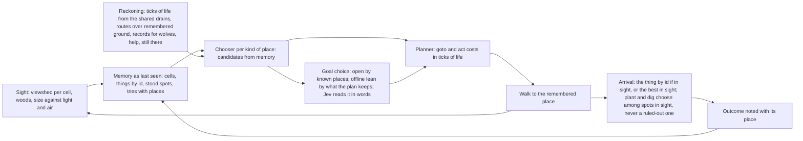
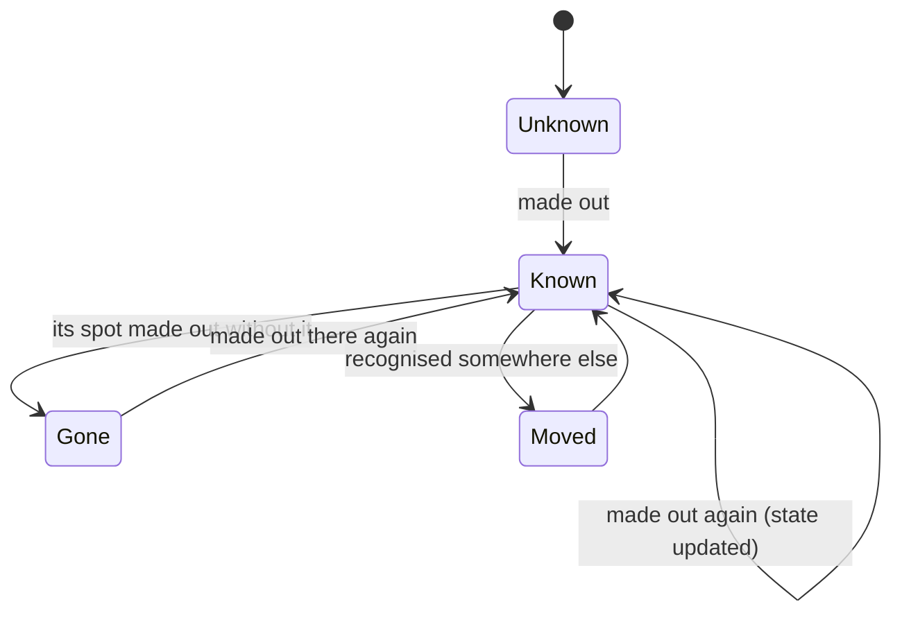
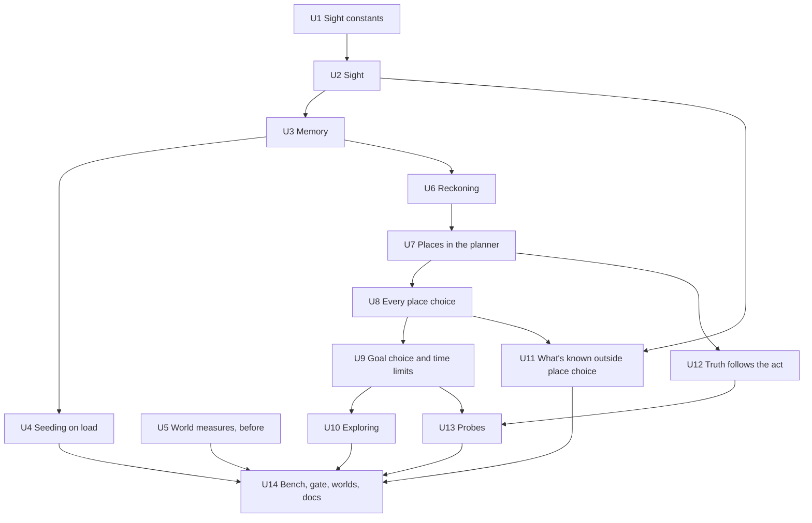

# feat: Places from memory, chosen by what they mean for survival

## Overview

Today a person knows every bush, stone and boulder within fixed radii, seen or not, and goes to the nearest. After this change:
- A person knows a place only once they've seen it, by a sight formula of size, light, air, hills and woods.
- They remember it as it was when they last saw it.
- They choose every destination from that memory by what going there means for their survival, worked out with the sim's own needs formulas.
- The fixed radii, the nearest-only searches, planting's first-spot fallback and the friend rule for shelters all go, in one cutover.
- Exploring is how new places come to be known.

The work comes in three phases (see Phased Delivery):
1. **Knowing.** Sight by formula and memory as last seen, recorded and saved, but read by no decision. The whole-world measures are added and taken before anything changes.
2. **Choosing.** The survival reckoning, then every place choice, goal choice and time limit moved onto memory and the reckoning. These land together.
3. **Truth and the gate.** The answer key follows the act, the planting probes are bounded to what planters know, a new probe judges the staged choices, then bench, gate, whole worlds and docs.

## Problem Frame

Nobody in the sim remembers a place (see origin: docs/brainstorms/2026-10-07-places-from-memory-requirements.md). Every destination is worked out again from the world itself each time someone thinks, and again on every tick of a walk:
- **Free knowledge within radii.** Inside fixed radii a person knows everything, seen or not: 800 m for things, 600 m for things lying about, 100 m for ground, 3 m for the spot.
- **Goals gated by distance.** Prey within 400 m, a fire within 60 m, home within 150 m.
- **No places in the record.** Tries are kept by condition, never by where.
- **A fallback into bad spots.** When no spot within 3 m suits their theories, they plant in an unsuitable one anyway. Round five found that every one of the 21 plantings into a hurting condition, with theories known from the start, was made by someone holding that exact theory (docs/research/learning-round5.md).
- **One friend rule.** A new shelter goes 6 to 15 m from the best-liked friend's home.

People no longer forget a try, and the operator wants them to use all they remember for every decision. They should know only what they've seen, and choose among known places by what each means for their survival, with no fixed weights and no hard rules.

Two facts of the sim's scale shape the plan:
- **Walking is slow.** People walk 2 m a 5-minute tick (sim.ts WALK), about 24 m an hour. So "an hour or two's walk" is 25 to 50 m, home's 150 m limit is six hours, and the 800 m search is a day and a half on foot.
- **The island is big.** It holds about 3.3 million grown things, 870,000 of them trees, on 256 by 256 cells of 75 m (128 by 128 tiles of 150 m). Grown things keep their ids (`t{k+1}`) when their tile is shelved and stocked again (space.ts shelve), so a thing remembered by id is the same thing later.

## Requirements Trace

From the origin document:
- R1. A person knows a place, and what's there, only once they've been there or seen it. How far things can be made out follows from size and light by formula, and hills and woods hide what's behind them. Soil they know only where they've stood. Nothing is known for free. (U1, U2, U3, U10, U11)
- R2. They know a place as last seen until they see the spot without it, or see something they'd recognise somewhere else. (U3)
- R3. Nothing seen or done is forgotten. Every try keeps where it happened and what came of it, and decisions draw on all of it. (U3, U11)
- R4. Every place a decision sends someone to comes from what they know, with no radius, nearest-only shortcut, first-spot fallback or friend rule left, all in one piece of work. (U7, U8)
- R5. Each candidate is weighed by what doing it there means for their survival: what they expect to come of it, the time there and back now and on later trips (costed through the needs formulas), what being out there means, and how it stands to what keeps them alive. The one-day limit and the dark give-up yield to this. (U6, U7, U9)
- R6. They foresee with the world's own formulas what they can work out from memory. The uncertain parts (wolves, help, a thing still being there) come from their own record. (U6)
- R7. A spot a theory of theirs rules out is ruled out, except to test it. If no known place suits, they go and look or do something else. (U7, U10)
- R8. Remembered ground picks where to go; the exact spot is chosen on arrival from what's in sight. (U7)
- R9. What they choose to do at all weighs what the places they know offer, and whether a goal is open depends on known places, not a fixed distance. (U8, U9)

Success criteria:
- SC1 **Unseen things.** Never seen flint, no plan to fetch it. Once seen, they can plan for it at any distance and get there even if the trip takes more than a day. (U8, U9)
- SC2 **Moved things.** Something that moved is looked for where last seen, and updated when they see the empty spot or see the thing elsewhere. (U3, U7)
- SC3 **Staged choices.** These are judged by truth from src/sim/formulas.ts. Where going pays, the planter goes; where it doesn't, they stay. A better place far from home is weighed against a poorer one near it as the reckoning says. Nobody plants into a spot their theory rules out, except to test it. (U7, U13)
- SC4 **Whole worlds.** People stay, plant and forage near home and others, and settle into camps, because it pays. The worlds tier gains the measures to show it, taken before and after. (U5, U14)
- SC5 **No peeking.** No decision reads anything about the world the person hasn't seen, except their own body and what's in sight now. (U8, U11)
- SC6 **Planting probes.** Planters know only their own plot. Every planting is judged by the seedling formula wherever it lands, and the share made off the plot is reported. (U13)
- SC7 **The gate.** Probe claims that hold now still hold, except any named here as expected to move. Whole worlds are compared on the same seeds, and the bench shows the cost. (U14)

## Scope Boundaries

- **No talk about places.** People telling each other about places is a later step, alongside making talk carry theories (see origin).
- **No new pathfinding.** Trip times and whether a trip can be made come from walk.ts's own routing, run over the ground they remember, not today's land and ice.
- **What Jev is shown stays bounded:** a relevant selection from memory, not everything.
- **Walking costs only time.** Walking costs the body nothing beyond the time it takes; needs() drains the same walking or standing (origin assumption). The reckoning adds no effort term.
- **The round-six fire gap is out of scope.** Whole worlds make no fire, because tinder held bare stays damp (docs/research/fire-constants.md, gaps). That shapes how the whole-world measures read (Risks).
- **VERSION stays 17.** New state goes in optional fields (the operator's standing rule).
- **Drawing.** The renderer draws nothing new; only where heading() gets its target changes.

## Context & Research

### Relevant Code and Patterns

**Where places come from today:**
- src/sim/sim.ts `spot(w, a, kind)`:
  - homes and the camp store by id;
  - water by `nearestShore` or a well;
  - a hunted animal by `nearest` over every animal, at any distance;
  - things lying about by `nearestThing` within SEARCH (800 m);
  - fires by the nearest burning thing within SEARCH;
  - ground by `groundsNear`;
  - every THING_PLACES kind by `nearestThing` within SEARCH.
- `groundsNear` samples rings out to 100 m, and keeps the first point of each kind of ground no theory of theirs blames.
- `run()`'s `goto` calls `spot` again on every tick of the walk.
- `homesite` holds the friend rule: the best-liked friend's home within 600 m, a clear patch 6 to 15 m from its door.

**Planning:**
- src/sim/sim.ts `ctxFor` builds `Ctx.dist`, the nearest distance to each kind of place, in 15 m steps (STEP_M):
  - things lying about from `around` within 600 m;
  - home only within HOME_NEAR (150 m);
  - in the dark, a "blind" rule keeps only KNOWN places and what's in sight.
- src/sim/plan.ts:
  - `PState` is `{inv, at, flags}`, with `at` a kind of place.
  - A goto costs `1 + d/4`, one unit per 60 m.
  - An act costs `1 + ticks/8/chance`, plus `3 (1/chance - 1)` for what shows later.
  - BUILD_NEAR (10 steps) sends a shelter home or to a homesite.
  - `search` is a uniform-cost search capped at 3,000 states and 14 steps.

**Goal choice:**
- src/sim/sim.ts `feasible` offers goals by fixed distances:
  - a fire within 60 m (make_fire, tend_fire, experiment:fireside, lay_by_wood);
  - a fire within 100 m to contain, 150 m to share;
  - a wilting sapling within 100 m;
  - home within 300 m to store food, the store within 400 m to share;
  - prey within 400 m;
  - people within 600 m;
  - a raid target over 150 m off, its home within 500 m.
- `think` passes the options to brain.ts `decide`, a Jev choice over option texts; offline the leans are `needBias` and `PULL`.
- brain.ts `view` shows:
  - everything within 60 m;
  - animals and people within 300 m;
  - every known person with their live distance and their home's, seen or not (their doing only when in sight);
  - the last 8 memory lines.

**Time limits:**
- src/sim/sim.ts `agentTick` ends a goal after a day (three for making, building or moving).
- It gives up a foray where it stands when the dark falls.

**Reflex:**
- `reflex` sends someone freezing to the nearest person within 400 m, wherever they are.

**Sight today:**
- src/sim/light.ts `canSee` tests distance against a range shrunk by the target's brightness. Its callers:
  - perceive (300 m);
  - the dark rule (800 m);
  - view (300, 60 and 30 m);
  - watching (25 m);
  - witnesses (30 m and 300 m).
- `skyline` already walks a terrain profile from a 1.7 m eye, for the sun's beam.
- `canopyAt` and `skyShare` give the crowns over a point.
- src/terrain/climate.ts `horizons` has per-cell horizons along 16 bearings, for the sky's share.

**Facts by radius:** src/sim/beliefs.ts `see(w, center, key, text, radius)` hands facts to everyone within a radius. Callers:
- a wolf kill, 90 m;
- lightning, 1 km;
- a well, 80 m;
- a death, 300 m;
- a fire spreading, 60 m.

**Spots:** src/sim/physics.ts `spotNear` tries 24 points 1 to 3 m off, and returns the first that takes the seed if none passes `ok` (the fallback). `plant` and `digTick` call it.

**Walking:** src/sim/walk.ts `firstStep` is a breadth-first search over 150 m tiles that `walkable` allows. `landOf` labels the connected land.

**Journeys:** src/sim/journeys.ts keeps a point every 3 m walked (straight stretches folded), with times, saved and kept for good. Only the inspector reads it.

**Needs:**
- src/sim/sim.ts `needs` drains food 0.12 a tick and energy 0.1 by day and 0.16 by night.
- `warming` gives warmth's change from:
  - wind chill, night, wetness and what they wear;
  - roof heat;
  - huddling, 0.25 a person within 2 m at night, up to two;
  - the sun, and a fire's rise.
- Health falls 0.4 a tick while food or warmth is at zero, and recovers 0.1 a tick when both are over 40 and they're well. A second collapse within a day and a half kills.

**Wolves:** src/sim/animals.ts. A hungry wolf (hunger under 25) stalks a lone person within 150 m in the dark or in hard cold; a starving one (under 12) takes anyone alone. "Alone" means no one within 30 m and no fire within 40 m.

**Camps:** src/sim/groups.ts `cluster` runs daily, linking homes within 200 m, and traces camps founded.

**The answer key and the probes:**
- src/sim/formulas.ts `predict` uses `spotNear` from the stand-in's spot for planting and digging.
- scripts/truth.ts stages the stand-in at a random dry spot.
- scripts/probes.ts stages planting plots (PLOT_APART 16 m, PLOT_CLEAR 12 m), and judges each planting by `comingUp` at its own spot.
- `groundsSeen` mirrors `groundsNear`'s 100 m rings.

**Load-time migration:** src/sim/migrate.ts with server.ts `load()`, round six's pattern of a same-VERSION migration with a one-time backup.

**Caps:**
- the event memory, 12 lines (world.ts `log`);
- a relationship's history, 10 lines (brain.ts `reflect`, gossip);
- waiting on a seedling, given up after 30 days (sim.ts `giveUpWaiting`).

**Payloads:** sim.ts `agentDetail` spreads the whole Agent into the API, so any new Agent field reaches every client.

### Institutional Learnings

- .claude/napkin.md, Domain item 1: every outcome comes of a formula; no rule switches; conditions cut at the formula's edge; the answer key from predict; never retune to pass.
- .claude/napkin.md, Domain item 2: "Plans must not lean on far places" names ctxFor's HOME_NEAR and FIRESIDE. This plan retires both, so that item must be restated (U14).
- docs/research/fire-constants.md: constants come first, each cited or marked a gap, and a failing criterion is written up as a gap, never tuned away. U1 follows it for sight.
- docs/research/learning-round5.md:
  - evidence is thin and slow (a median of two tries per person per way in sixty days);
  - the spotNear fallback puts plantings in ground the planter blames;
  - whole-world learners waste about as much as people who never learn.
- .claude/napkin.md, Execution item 10:
  - commit the evals ledgers with the code they judged;
  - a search that looks at (stocks) other tiles, or in another order, moves every later draw, so it needs the gate like any rule change;
  - run the bench before and after.

### External References

Sight's constants (acuity against light, the contrast of natural targets, the air's extinction by weather, sight lines through woods, a fire's light at night) need cited sources. U1 gathers them into a constants document as round six did for fire. The code's structure needs no outside reference: its own patterns cover it.

## Key Technical Decisions

- **D1. Sight's constants first.** Every number the sight formula uses comes from docs/research/sight-constants.md, cited or marked a gap, fixed before any criterion is checked (the operator's rule for fire, applied to sight). A throwaway check of the ranges the picks give on real islands goes in that document before U2 starts.
- **D2. Sight, in three parts.**
  - What the land allows: a viewshed for each 75 m cell, from a 1.7 m eye over the generator's heights, cached in a bounded cache (heights never change, but the play page runs the same sim in a browser tab already near its memory limit).
  - What the woods allow: transmission along the sight line through the trees standing now, so felling opens the view.
  - What can be made out there: whether the target's angular size beats the eye's threshold at the light on it, through the air's extinction for the weather.
  - Fires and lamps at night are made out by their light. canSee's fixed ranges go.
  - Looking reads grown things from the generator's arrays, as drawing does (space.ts `objects`), and stocks no tile. A hilltop's view stocked would hold hundreds of thousands of Things (napkin Execution item 8), and stocking moves later draws.
- **D3. Memory, as last seen.** Each person keeps an optional `known` field:
  - **Cells.** For each 75 m cell seen: when, what was made out there by kind of place (counts), and the look of its ground.
  - **Things by id.** Everything they'd recognise or that is a place of its own, each with last-seen point, time and state: their own things, people, fires, structures, boulders (noting nodules once seen close), bushes, stumps, fallen logs, dead bushes, reeds, clay, resin-beaded trees, things lying about.
  - **Stood.** Spot conditions of the cells they've stood in.
  - **Tries.** Every try's place, time, conditions and outcome.

  Kinds there are a great many of (trees, grass, grown stones and sticks) are kept as counts per cell, and the exact one is picked on arrival (R8). That keeps memory proportional to the places a person can use, not to the 3.3 million things in view of a hilltop. Nothing is capped or forgotten (R3).
- **D4. A survival currency: ticks of life.**
  - **The measure.** From their needs as they'd stand, and the drains the formulas give where and when they'd be: how long until food or warmth runs out, with health then falling 0.4 a tick to collapse.
  - **A plan's worth** is the ticks of life it adds (food held or stored, warmth from a fire, roof or others near, a bush's future berries over the trips to pick them), less those it spends (its time at the drains of where and when they'd be, a night out, the wet and cold), less the harm it risks.

  Every term comes from needs(), warming(), the eating formula and their records, so there are no weights. The same currency serves the planner's costs, goal choice and the time limits.
- **D5. One source of drains.** The per-tick drains of needs() and warming() move into a pure function of the body and its surroundings. needs() and the reckoning both call it, so they can't drift apart (as predict shares the acts' functions).
- **D6. The planner keeps its small abstract search.**
  - Per kind of place, a chooser outside the search picks the remembered place by the reckoning, and hands the planner that place with its cost.
  - Goto and act costs move into ticks of life.
  - The chosen place is held on the plan step, an optional field, so the walk goes where memory says instead of re-finding by kind each tick.
  - On arrival, the thing by id if it's in sight, or else the best of its kind in sight there.
- **D7. No fallback.** spotNear's first-spot fallback goes. Plant and dig choose among spots in sight on arrival, and a spot a theory rules out is never chosen except in a test of that theory (R7). Nowhere suits: they don't plant, and plan again.
- **D8. A spot's own record is evidence.** A spot's own tries move its chance away from what its conditions say only as far as spots that look alike have differed in their own record, an empirical-Bayes weight from that record and no constant. One failure on good-looking ground says little; repeated failures say more (see origin, Key Decisions).
- **D9. Goal choice sees places.** A goal is open when they know a place that serves it and a plan exists.
  - Offline, a place-served goal's lean is multiplied by what its best plan keeps, from the reckoning alone (no constant). For a goal whose gain the reckoning can count (food, warmth, rest, a roof, a fire, a planting), that is the share of what it gains left after what it spends. For a goal whose gain it can't (making a tool, an experiment), it is the share of the plan's time spent doing rather than getting there, so a tool whose stone lies far off leans less without leaning nothing.
  - Goals no place serves (talk, teach, tinker, tests) keep today's leans.
  - Jev reads the same in words in the option and in view.
- **D10. Time limits yield to the reckoning.** The one-day goal limit and the dark give-up go. When the light falls, the weather turns, a need goes critical, or an hour passes on a goal, the rest of the plan is reckoned against stopping now and heading back. A trip longer than the daylight left is weighed as a night out. The critical-need interrupt stays: it is the body, not a distance.
- **D11. Uncertain parts from records.** Their own experience and what they made out happening to others both count, as watching counts for beliefs:
  - wolves: attacks per hour spent alone in the dark or hard cold;
  - help: how often someone came when they collapsed or asked;
  - a remembered thing still there: by kind and days since seen, from revisits, which takes in regrowth and depletion without anyone knowing those formulas.

  Things between sightings are held as last seen; the record says how far to trust that.
- **D12. Exploring.** Toward unseen cells at the edge of what they know, chosen by the trip's reckoning and their record of what new ground held per hour spent looking, by how it looked from afar. When a goal's kind of place is unknown, looking for it is the option.
- **D13. Free knowledge goes.**
  - see() reaches whoever makes out the event, by its size.
  - Watching and witnesses go by sight.
  - view() shows what's in sight, and people out of sight as last seen.
  - Tinkering's 20 m and 60 to 120 m go to what's in sight.
  - The dark "blind" rule goes.
  - An audit classifies every world read in decision code (U11).
- **D14. Old saves.** A save without memory seeds each person's from their journey at load: what's in sight of each point at that point's time, as the world stands at load (see origin, Dependencies). It runs once per person, behind a backup.
- **D15. The planting probes.**
  - Each planter's memory is their plot as seen from it.
  - Plantings are judged wherever they land.
  - New numbers: the share made off the plot, and the share into spots their theories rule out.
  - A new probe, "far", stages the choices of SC3, with the reckoning (on the seedling formula's chances) as its truth.
  - Versions bump: probes 7; worlds 7 and live 7, for the key's spot choice.

## Open Questions

### Resolved During Planning

The origin's deferred questions:
- **How memory is held:** D3. Things by id (grown ids are stable across shelving), counts per cell for kinds there are a great many of, stood spots, and tries with places. An optional Agent field; VERSION stays 17. Sizes are measured in U3.
- **The sight formula:** D1 and D2, with constants researched in U1.
- **Where candidates are weighed, and how the place is held:** D6. A chooser per kind of place outside the planner's search; the place held on an optional Step field; re-found in sight on arrival.
- **The reckoning in the planner's cost, and caching:** D4 and D6.
  - One route search per think gives every tile's distance at once.
  - A cell's viewshed is cached for good.
  - A place's expectation is cached until their memory of it or its record changes.
  - The cold of a night out comes from the shared drains (D5).
- **How places reach goal choice for both brains:** D9.
- **Which records count for wolves, help and things still there, and whether others' experience counts:** D11. Theirs and what they made out happening to others.
- **Projected forward or held as last seen:** held as last seen. The expectation of finding something again comes from their revisit record (D11).
- **Caps:**
  - The event memory and relationship histories are kept whole, and what Jev reads is a bounded selection by relevance (U11).
  - Waiting on a seedling is still given up after 30 days, which is a behaviour; the planting's place and outcome stay in memory for good (R3).
- **Jev's view by relevance:** U11. Per option, the place it would use in words; the latest memories plus those about the places and people the options name; bounded counts.
- **Exploring:** D12.
- **Free knowledge outside place choice:** D13.
- **predict's spotNear:** predict calls the act's own spot chooser (U12).

### Deferred to Implementation

- **The viewshed algorithm and its cache layout** (a radial sweep over the 75 m heights, or per-target profiles as `skyline` walks), chosen by measured cost against the bench budget.
- **The memory's exact encoding** (typed arrays per cell or records), chosen once U3 measures sizes over a 60-day world.
- **The empirical-Bayes estimator for a spot's record** (D8): its exact form is fixed against the U7 test cases.
- **The projection's step** (hourly steps or closed form between events) and how far ahead it runs, fixed so the U6 equivalence test holds.
- **The re-reckoning triggers' thresholds** (when the light "falls", when a need is "critical") reuse existing cuts: DARK, and the critical need under 20.
- **Whether `inSight` refreshes hourly or on a coarser beat while someone stays in one cell**, by its measured cost.

## High-Level Technical Design

> *This illustrates the intended approach and is directional guidance for review, not implementation specification. The implementing agent should treat it as context, not code to reproduce.*

How a choice of place flows, after the change:

What a remembered thing goes through:

How the units depend on one another:

## Implementation Units

### Phase 1: Knowing

- [ ] **Unit 1: Sight constants**

**Goal:** Every constant the sight formula uses is in a constants document, cited or marked a gap, before any code reads it, together with what the picks mean on the island.

**Requirements:** R1; D1.

**Dependencies:** None.

**Files:**
- Create: `docs/research/sight-constants.md`

**Approach:**
- **The eye:** the smallest angle at which a target is made out against its background, from daylight to starlight (acuity and contrast thresholds against luminance), and how the sim's lux maps to the luminance of natural surfaces.
- **The target and the air:** the contrast of natural targets against their backgrounds, and its fall with distance through the air (Koschmieder's law, with extinction for clear air, haze, rain and storm, matched to the sky states the sim has).
  - Targets: a bush or tree against grass or sky; a stone, stick or boulder in grass; a person.
- **Light at night:** a fire's and a lamp's luminous intensity (fire-constants section 31 gives them) against the threshold for a point of light, and a lit person.
- **Woods:** how far one sees through standing trees and understorey, by stand density and stem diameter (a Beer-Lambert reading over stems, using fire-constants section 19's allometry for the island's trees).
- **The land:** eye height (1.7 m, as light.ts `skyline`), and the earth's curvature and refraction over the island's 19.2 km.
- **Target sizes:** the sim's own (Thing.size, people, structures), and which dimension counts (a stick's length or its thickness).
- **Picks first.** Picks are written before any code reads them, as fire-constants did, with a gaps list.
- **A throwaway check, not kept**, run over three islands:
  - how far each kind of thing is made out at noon, at dusk and at midnight, under each sky;
  - what share of the land one sees from a hilltop, a valley floor and a wood's edge.

  The numbers go in the document.

**Patterns to follow:**
- docs/research/fire-constants.md: sections of Quantity, Value, Units, Conditions and Source; picks; disagreements; a gaps list.

**Test expectation:** none. This unit is research; the check's results are recorded in the document.

**Verification:**
- Every constant U2 names resolves to a cited row or a marked gap.
- The check's ranges are written down.
- If they leave people near-blind (woods hiding everything) or all-seeing (hilltops showing the island), the operator hears it before U2 starts.

- [ ] **Unit 2: Sight**

**Goal:** Whether someone makes out a thing follows from its size, the light, the air, the land and the woods between.

**Requirements:** R1; D2.

**Dependencies:** U1.

**Files:**
- Create: `src/sim/sight.ts`
- Test: `src/sim/sight.test.ts`

**Approach:**
- **The land:** a viewshed for each 75 m cell from eye height over the generator's heights (groundOf), out as far as the largest target can be made out by day in clear air. Heights never change, so a viewshed never goes stale; the cache is bounded all the same (least recently used), sized by measurement, since the play page runs this sim in a browser tab near its memory limit (napkin Domain item 2).
- **The woods:** transmission along the line through the trees standing now, read from the cells' tree cover, which follows felling.
- **What's made out:** `madeOut` decides whether a target of a size at a point is made out from where someone stands. The line must be clear of land and woods, and the target's angular size must beat the eye's threshold at the light on it (light.ts `lightOn` at the target) through the air's extinction for the weather now. Fires and lamps at night are made out by their light.
- **What's in sight:** `inSight` gives the things made out now, by kind. It walks the visible cells nearest first, and asks only for kinds big enough to be made out that far, so nobody looks for stones two kilometres off.
- **Looking stocks nothing.** Grown things in tiles not stocked are read from the generator's arrays (space.ts `objects` reads them so for drawing); stocked and made things from the index. A hilltop's view stocked would hold hundreds of thousands of Things and keep its tiles from ever shelving (napkin Execution item 8), and stocking would move later draws.
- **Distant cells cost a lookup.** Per-cell summaries of the grown things by kind (counts and largest sizes), built once per world from the arrays, answer for cells too far for anything but big things to be made out; only near cells are walked thing by thing.
- **Callers stay put for now.** No caller moves onto sight in this unit; canSee's callers move in U11, so Phase 1 leaves decisions on today's rules.

**Patterns to follow:**
- light.ts `skyline` (a terrain profile from a 1.7 m eye) and `canopyAt`.
- space.ts `nearestThing` and `lookFor` (tiles nearest first, stocking what they touch).
- perWorld caches (world.ts).

**Test scenarios:**
- Edge case: a person on the far side of a ridge isn't made out from the valley below; the same person on the ridge top is.
- Edge case: a person 80 m into a closed wood isn't made out from outside it; one 80 m off over open grass is.
- Happy path: by day, a stone is made out at 20 m and not at 200 m; a tree is made out at a kilometre.
- Happy path: at midnight under a clear sky, a person 50 m off with no fire near isn't made out. A campfire 500 m off is, by its light, and so is a person standing beside it.
- Edge case: in a storm, a tree is made out at a shorter range than in clear air.
- Integration: felling the trees on the line between two points lets one make out the other.

**Verification:**
- The tests pass.
- A throwaway timing gives the cost of a viewshed per cell and of `inSight` per call, recorded in the plan's result for U3's budget.

- [ ] **Unit 3: Memory**

**Goal:** Each person keeps what they've made out, as last seen, and every try's place, for good. It's saved, and no decision reads it yet.

**Requirements:** R1, R2, R3; D3; SC2.

**Dependencies:** U2.

**Files:**
- Create: `src/sim/memory.ts`
- Modify: `src/sim/world.ts` (an optional `known` field on Agent, and its types)
- Modify: `src/sim/sim.ts` (memory updated as people move, look and act; `agentDetail` and `summary` leave it out of the API)
- Modify: `src/sim/beliefs.ts` (a try's place goes to memory beside noteTry's record by condition)
- Test: `src/sim/memory.test.ts`

**Approach:**
- **What's kept:** as D3.
- **First look.** A new world's people know what's in sight where they come ashore, and nothing else.
- **Refresh.** When someone enters a new cell, and every hour while they stay, what's in sight replaces what memory held for the cells in view. A thing seen without it there is noted as gone. People and animals in sight are noted every tick, as perceive notices people now.
- **Recognised things move.** A thing they'd recognise, seen somewhere else, moves its record (R2): a person, their own things, anything distinctive.
- **Tries keep their place.** A try records its place. A planting records its outcome when it comes up or withers (sim.ts `came`, and the withered hook it registers with ecology.ts).
- **No caps.** There are none on cells, things or tries (R3).
- **Saved, but not served.** Memory is saved with the world and kept out of the API's agent payloads. Grown ids are stable (`t{k+1}`), so a remembered thing is the same Thing when its tile is stocked again.
- **The dead.** When someone dies, their memory goes with them, as their beliefs do now.

**Patterns to follow:**
- src/sim/journeys.ts: a per-person, saved, never-forgotten record, updated once a tick.
- Optional fields with lazy defaults (`??=`), as journeys and wetness do.

**Test scenarios:**
- Happy path: a flint boulder behind a ridge from where someone has always stood isn't in their memory. Once they've stood where it's in sight, it is, with where and when.
- Edge case: berries picked off a remembered bush, out of their sight, leave their memory as it was. Seeing the bush again updates it.
- Edge case: a remembered stick taken while they're away is noted gone once they make out its spot without it, and not before.
- Happy path: a person they know, last seen at one place and made out at another, moves to the other in their memory. Their own axe, set down and then seen in someone's hands, moves to that person.
- Happy path: a planting's spot and outcome are in memory when it comes up, and still there after 200 more tries.
- Integration: saving and loading keeps memory whole; a save without the field loads, and its people know nothing until U4 seeds them.
- Edge case: the agent payload served to clients carries no memory.

**Verification:**
- The tests pass.
- Over a 60-day world: memory's size per person, the save's growth, and its cost per tick are measured and recorded.
- The bench's checksums are unchanged: sight and memory stock no tiles and draw nothing from the random stream, so Phase 1 changes no run.

- [ ] **Unit 4: Seeding memory on load**

**Goal:** A save from before this change wakes knowing what its people have seen (see origin, Dependencies).

**Requirements:** R1 (old saves); D14.

**Dependencies:** U3.

**Files:**
- Modify: `src/sim/migrate.ts`, `server.ts`
- Test: `src/sim/migrate.test.ts`

**Approach:**
- **Seeding.** Each person without memory is seeded from every point of their journey, as made out from there at that point's time, with the world as it stands at load. Journeys know where better than when, and what changed since is known as it is now. Then what's in sight where they stand is added.
- **Old tries keep no place.** Nobody can say now where they were (beliefs.ts noteTry's own reading for old saves).
- **Once.** Only a person without memory is seeded.
- **Backup.** A backup of the save before its first seeding is written once, beside round six's (migrate.ts BACKUP pattern, under its own name).

**Patterns to follow:**
- src/sim/migrate.ts `migrateSave` and its test file.

**Test scenarios:**
- Happy path: someone whose journey passed a boulder knows it after load, at the time of the journey point it was seen from.
- Edge case: someone with no journey knows only what's in sight where they stand.
- Edge case: loading a second time changes nothing.
- Integration: the backup is written before the first seeded save.

**Verification:**
- The tests pass.
- A copy of the live save, loaded offline (never the live server), gives its people the places around where they've walked.

- [ ] **Unit 5: Whole-world measures, taken before the change**

**Goal:** The worlds tier reports where people plant and forage against homes, deaths away from home and fire at night, and camps formed, measured on the build before the change.

**Requirements:** SC4.

**Dependencies:** None. It lands first, so the "before" is today's behaviour.

**Files:**
- Modify: `scripts/theories.ts`, `scripts/theory-report.ts`, `scripts/evals.ts`

**Approach:**
- **theories.ts writes:**
  - each planting's distance to the planter's home and to the nearest other home;
  - each finished goal that took someone out (foraging, gathering, hunting, planting, exploring): its type, and the farthest it took them from home;
  - each death's place: whether at night, its distance to home and to the nearest fire (extending round six's death line);
  - each camp founded (groups.ts "found").
- **theory-report.ts** gives medians and shares over the runs.
- **evals.ts** reports them beside the worlds numbers, monitored and not judged.
- **The "before".** Run the worlds tier on the current build (the worlds 6 baseline's seeds 1 to 6, 60 days) and keep the ledger entry. The origin named round five's baseline; round six now stands in its place.

**Patterns to follow:**
- Round six's death and wood lines in scripts/theories.ts, and the worlds tier's monitored numbers.

**Test expectation:** none. These are measurement scripts; a smoke run of one seed shows each measure.

**Verification:** the before numbers are in a committed ledger entry and in this plan's result.

### Phase 2: Choosing (lands together)

- [ ] **Unit 6: The survival reckoning**

**Goal:** What a plan means for survival, in one currency, from the needs formulas.

**Requirements:** R5, R6; D4, D5, D11.

**Dependencies:** U3.

**Files:**
- Create: `src/sim/reckon.ts`
- Modify: `src/sim/sim.ts` (needs() and warming() call the extracted drains)
- Modify: `src/sim/walk.ts` (route lengths over a pass function)
- Modify: `src/sim/memory.ts` (records for wolves, help, and things still there)
- Test: `src/sim/reckon.test.ts`

**Approach:**
- **Drains.** The per-tick drains move out of needs() and warming() into a pure function of the body and its surroundings: air felt, wind, night, wetness, roof and insulation, fire flux, people within 2 m, what they wear, sun. needs() calls it, so the extraction changes nothing. The bench checksums must be unchanged after the extraction alone, before anything reads it.
- **Timeline:**
  - Walking time comes from a route over the tiles they remember as walkable, by walk.ts's own search. One search per think gives every tile's distance. Speed is the walk's own (speedOf) at the light the hour will have (light.ts `moveRate`).
  - The doing's time comes from their belief's record.
  - Day and night come from sky.ts and world.ts `isNight`, run forward.
  - The weather is as they read it now, its warmth swinging over the night by air.ts's own daily curve.
- **What it adds:**
  - food they'd hold or reach in a store, by physics.ts's eating formula;
  - warmth from a fire they'd keep (fireHours), a roof, and others sleeping near (from who they remember sleeps where);
  - energy from rest;
  - a planting's bush, over the trips to pick it, by their record of berries per visit.
- **What it risks,** from records (D11): wolves, by attacks per hour alone in the dark or hard cold, theirs and those they made out; help, by how often someone came; things still there, by revisits by kind and days since seen.
- **The worth.** A plan's worth is the ticks of life it adds less those it spends, projected over the plan, the way back, and the night after.

**Patterns to follow:**
- src/sim/formulas.ts: the acts and predict share functions so they can't drift.
- light.ts `heatAt` and `warming`'s rise, for a fire's warmth.

**Test scenarios:**
- Happy path: projecting needs 24 ticks ahead in a fixed setting gives what needs() ticked 24 times there gives.
- Happy path: a night out on open ground at 2 C costs more ticks of life than the same night in a hut, and a night beside a fire costs less than both.
- Happy path: a 6-hour foraging trip begun at noon in summer is worth more than the same trip begun two hours before dusk in a cold wind.
- Happy path: with berries stored at home, a plan that ends at home lasts longer on food than one that ends two days' walk away.
- Edge case: someone who has made out no wolf attack takes no wolf risk. After making out two attacks on lone people in the dark, a dark trip alone costs them more.
- Edge case: a route over remembered ground goes round a lake they've seen. Across ground they've never seen, no route is assumed.
- Integration: needs and warmth tests (src/sim/warmth.test.ts and those using needs) pass unchanged.

**Verification:** the tests pass, and the bench checksums are unchanged by the drains' extraction alone.

- [ ] **Unit 7: Places in the planner**

**Goal:** The planner goes to places they remember, chosen by the reckoning, holds the chosen place on its step, and chooses the exact spot on arrival from what's in sight. It never falls back into a spot a theory rules out.

**Requirements:** R4 (the mechanism), R5, R7, R8; D6, D7, D8; SC2, SC3.

**Dependencies:** U3, U6.

**Files:**
- Modify: `src/sim/plan.ts` (places per kind with their costs; goto and act costs in ticks of life)
- Modify: `src/sim/sim.ts` (ctxFor builds places from memory; run's goto walks to the step's place and finds it in sight on arrival; plant and dig choose among spots in sight)
- Modify: `src/sim/physics.ts` (spotNear's fallback goes; the spot chooser takes spots in sight)
- Modify: `src/sim/world.ts` (an optional remembered place on Step)
- Modify: `src/sim/beliefs.ts` (a spot's own record weighed against its conditions)
- Test: `src/sim/places.test.ts`, `src/sim/plan.test.ts`

**Approach:**
- **Candidates.** `Ctx.dist`, the nearest of each kind, becomes per kind the place a chooser picked from memory, with its cost in ticks of life. Candidates are every remembered place of the kind. Each is scored by what they expect there (their theories, and their record by the conditions they know of it, and for things that change their still-there record) against the reckoning's trip. Ground keeps one place per kind of ground, its best spot.
- **Old plans.** A saved step without a place finds its kind in memory, as the chooser would, so worlds saved mid-plan run on.
- **Costs.** Goto costs the trip from where the plan stands; an act its ticks at the reckoning's drains; what shows later the cost of a failure, as now but in ticks. Ways and goals then compare in one currency.
- **The step holds its place.** A plan step holds the chosen place (point, cell, thing id) in an optional field, so saved plans still load. The walk goes where memory says. On arrival it takes the thing by id if it's in sight, or else the best of its kind in sight there. If none is there, memory notes it gone, the step fails, and they plan again from memory.
- **Spots on arrival.** Plant and dig choose among the spots in sight around them, by the same expectation and the steps to each. A spot a theory of theirs rules out is never chosen, unless they're testing that theory, and then only such a spot is. If none suits, they don't plant, and they plan again (R7).
- **A spot's own record (D8).** Its own tries move its chance from what its conditions say only as far as spots that look alike have differed in their record.

**Patterns to follow:**
- plan.ts `beliefOps`'s ways per kind of ground, and `chance`/`ruledOut`.
- sim.ts `choose`, which picks a lay's pieces by their theories.
- The existing test-goal path (a test plants just where its theory holds).

**Test scenarios:**
- Happy path (SC3): good ground is remembered 40 m off, with only deep shade at hand. At noon in summer, the planter walks to the good ground. At dusk before a frost, they plant at hand or not at all, as the reckoning says.
- Error path (SC3): a spot ruled out by a theory of theirs is never planted into, except in a test of that theory, where only such a spot is used.
- Error path: when no spot in sight suits, they don't plant, and their next plan goes elsewhere.
- Integration (SC2): the berries on a remembered bush are picked out of their sight. They go to it, find it bare, memory updates, and the next plan goes elsewhere.
- Edge case: one failure at a grassland spot, where 20 of their grassland plantings came up, barely moves its chance; five failures there put it below the rest.
- Happy path: the goto walks to the remembered bush, not to a nearer bush they've never seen.
- Integration: plan.test.ts cases that relied on nearest-per-kind distances are restated on remembered places.

**Verification:** the tests pass.

- [ ] **Unit 8: Every place choice moves**

**Goal:** Every decision R4 lists draws its places from memory through Unit 7, and the fixed radii, nearest-only searches and the friend rule go.

**Requirements:** R4, R9 (what's open); SC1, SC5.

**Dependencies:** U7.

**Files:**
- Modify: `src/sim/sim.ts` (spot, groundsNear, ctxFor, feasible, planGoal, reflex, and run's hunt, raid, follow, tend, pick_up and assist)
- Modify: `src/sim/plan.ts` (BUILD_NEAR, hunting)
- Modify: `src/sim/groups.ts` (the store's reach)
- Test: `src/sim/places.test.ts`

**Approach:**

| Decision | Today | After |
|---|---|---|
| Planting, digging | groundsNear rings to 100 m; spotNear within 3 m, with the fallback | Known ground by the reckoning; a spot in sight on arrival (U7) |
| Foraging (bush, mushroom, herb, grain) | nearestThing within 800 m | Remembered places, as last seen |
| Gathering (stone, stick, reeds, clay, resin, bark, ore, flint) | nearestThing within 800 m | Remembered places; a boulder seen studded with nodules is a place of its own |
| Things lying about | around, within 600 m | Remembered things |
| Trees, stumps, logs, dead bushes | nearestThing within 800 m | Remembered |
| Water | nearestShore or a well, any distance | Remembered shore and wells |
| Fire, hearth, kiln, forge | nearest burning within 800 m; 60, 100 and 150 m gates | Remembered fires, as last seen burning |
| Home | only within 150 m | Their home wherever it is, weighed by the trip |
| Storing, sharing, the camp's store | 300 and 400 m gates | Remembered |
| Their seedlings and pits | a sapling within 100 m; a pit within 800 m | Their own, remembered |
| A shelter's site, moving home | homesite: a friend's home within 600 m, 6 to 15 m from it; BUILD_NEAR | Known spots by the reckoning (stores, fire and others near count through survival) |
| Hunting | the nearest animal of the kind, anywhere; a 400 m gate | Animals as last seen, with the still-there record |
| Raiding | the target's home with a store, anywhere | A home they know holds a store |
| Finding a person | the person's true position | Where they last saw them |
| Huddling in the cold (reflex) | the nearest person within 400 m, wherever | The nearest person they know of, as last seen |

- **What's open.** feasible's distance gates go: a goal is open when they know a place that serves it and a plan exists.

**Patterns to follow:**
- Unit 7's chooser.

**Test scenarios:**
- Happy path (SC1): someone who has never seen flint has no plan to fetch it, though a flint boulder lies 200 m off. Once they've seen one a day and a half's walk away, they plan for it, and they get there across a night.
- Integration (SC5): while each of these is out of their sight, its true state changes, and the place their plan heads for doesn't: a fire goes out, a bush is stripped, a stream they remember running runs dry, a known person walks away, prey moves on.
- Happy path: a first shelter goes where the reckoning puts it among known spots (beside the home whose store and fire they can reach, say), not 6 to 15 m from a friend's door because they're a friend.
- Happy path: a home 400 m off, past today's 150 m, is where they go to sleep when the reckoning says the walk pays, and not when it doesn't.

**Verification:**
- The tests pass.
- No fixed-radius constant used to choose a place remains (SEARCH, HOME_NEAR, FIRESIDE, BUILD_NEAR, and the 400, 600, 300, 100 and 60 m gates), checked and listed in the result.

- [ ] **Unit 9: Goal choice and time limits**

**Goal:** What they choose to do weighs what the places they know offer, and a trip is cut short only when the reckoning says so.

**Requirements:** R9, R5 (the time limits); D9, D10; SC1.

**Dependencies:** U7, U8.

**Files:**
- Modify: `src/sim/sim.ts` (feasible gives each place-served option its plan's worth; agentTick's limits)
- Modify: `src/sim/brain.ts` (needBias leans by what the plan keeps; option words)
- Test: `src/sim/places.test.ts`, `src/sim/light.test.ts`

**Approach:**
- **Worth on each option.** Each place-served option carries its best plan's worth from the reckoning.
- **Offline leans.** Offline, the lean is multiplied by what the plan keeps (D9): of a countable gain, the share left after what the plan spends (near and good keeps most, far or poor little, one that doesn't pay nothing); of a gain the reckoning can't count, the share of the plan's time spent doing rather than getting there. Options no place serves keep today's leans.
- **Jev's words.** Jev reads the same in the option's words ("Pick berries at the bushes about three hours north, back before dark") and in view (U11).
- **Time limits.** agentTick's one-day limit (three days for making, building or moving) and the dark give-up for forays go (D10).
  - When the light falls past DARK, the weather turns, a need goes under 20, or an hour passes on the goal, the rest of the plan is reckoned against stopping now and heading back.
  - They go on only if it pays more.
  - A trip longer than the daylight left is weighed as a night out.
  - The critical-need interrupt stays.

**Patterns to follow:**
- brain.ts `needBias` and `PULL` (offline leans).
- sim.ts `goalText`.
- light.test.ts's dark give-up case (restated).

**Test scenarios:**
- Happy path: offline, foraging at a known bush 20 m off leans more than foraging at the only known bush 200 m off, other things equal.
- Happy path: a foraging trip begun at noon with a six-hour round trip goes on past dusk when the night is mild and finishing pays, and turns back at dusk before a frost.
- Happy path (SC1): no goal ends for having lasted a day; a trip of a day and a half to known flint reaches it.
- Integration: light.test.ts's "whoever is out after something when the dark falls gives it up" becomes: they give it up when going on doesn't pay, and not otherwise.

**Verification:** the tests pass.

- [ ] **Unit 10: Exploring**

**Goal:** When nothing known serves, they go and look, and looking is weighed like any trip.

**Requirements:** R1 (exploring is how places come to be known), R4, R7; D12.

**Dependencies:** U7, U9.

**Files:**
- Modify: `src/sim/sim.ts` (planGoal's explore; looking for a kind)
- Modify: `src/sim/memory.ts` (a record of what new ground held)
- Test: `src/sim/places.test.ts`

**Approach:**
- **Where to look.** Exploring goes toward unseen cells at the edge of what they know, chosen by the trip's reckoning and their record of what new ground held per hour spent looking, by how it looked from afar: woods, grass, shore, hills. Today's random point 80 to 400 m off goes.
- **Looking for a kind.** A goal whose kind of place they know none of (no bush, no flint) offers looking for that kind, weighed by their record of finding it when exploring. With no record, it is weighed as exploring is today.
- **Night out.** An exploring trip that would run past daylight is weighed as a night out (U6).

**Patterns to follow:**
- Unit 7's chooser.
- planGoal's experiment branch, which gathers what an aim needs first.

**Test scenarios:**
- Happy path: hungry, and knowing no bushes, they explore toward unseen ground rather than stand. Once a bush is made out, their next foraging plan goes to it.
- Happy path: with unseen ground on two sides, they look on the side whose look from afar has held bushes for them before.
- Edge case: an exploring trip that would end after dark in a frost is weighed as a night out, and not taken when it doesn't pay.

**Verification:** the tests pass.

- [ ] **Unit 11: What's known outside place choice**

**Goal:** Nothing else hands out knowledge by radius. Facts, witnesses, watching, Jev's view and tinkering all go by sight and memory.

**Requirements:** R1, R3; D13; SC5.

**Dependencies:** U2, U3, U8.

**Files:**
- Modify: `src/sim/beliefs.ts` (see; watchers)
- Modify: `src/sim/light.ts` (canSee's range goes; every caller says what it looks at)
- Modify: `src/sim/sim.ts` (perceive, feasible's people and fallen, the collapse notice, incidents' witnesses, tinkerOptions, ctxFor's dark rule)
- Modify: `src/sim/groups.ts` (witnesses)
- Modify: `src/sim/brain.ts` (view, recent memory)
- Modify: the see() callers in `src/sim/animals.ts`, `src/sim/ecology.ts`, `src/sim/life.ts`, `src/sim/physics.ts`
- Test: `src/sim/sight.test.ts`, `src/sim/memory.test.ts`, `src/sim/light.test.ts`

**Approach:**
- **Facts.** see() reaches whoever makes out what happened, by the event's size: a deer brought down, a tree struck by lightning, a well filling, a death, fire spreading.
- **Watching and witnesses** (beliefs.ts watchers at 25 m; witnesses at 30 m and VISION): whoever makes out the act, by the size of what's done and the light.
- **canSee.** Its range argument goes, and every caller states what it looks at.
- **Jev's view:**
  - what's in sight now, not everything within 60 m;
  - animals in sight;
  - people in sight, and known people out of sight as last seen (where and when), not their live distance;
  - recent memory as a bounded selection: the latest, and those about the places and people the options name;
  - the event memory and relationship histories kept whole (R3).
- **Tinkering:** things to strike and animals to throw at are those in sight within reach.
- **The dark rule goes** from ctxFor. In the dark they see less (sight) and remember everything (memory).
- **The audit.** Every world read in decision code (sim.ts, plan.ts, brain.ts, groups.ts) is classified: their own body, what's in sight now, their memory, or the act's own physics at its spot. The list goes in the result.

**Patterns to follow:**
- Unit 2's `madeOut` and `inSight`.

**Test scenarios:**
- Edge case: a deer brought down by wolves behind a ridge 80 m away teaches no one beyond the ridge what a deer holds. One in the open 300 m off, by day, does.
- Edge case: a theft deep in a closed wood 60 m off has no witness outside it.
- Happy path: view lists a known person out of sight with where and when they were last seen, not where they are.
- Integration: light.test.ts's canSee cases (made out by day, not at night, again by a fire's light) restated on sight.
- Edge case: after 50 events, the event memory still holds the first, and Jev's view shows a bounded number.

**Verification:** the tests pass, and the audit list has no unclassified read.

### Phase 3: Truth and the gate

- [ ] **Unit 12: Truth follows the act**

**Goal:** The answer key's plantings and digs land where the act's own spot choice puts them.

**Requirements:** the origin's question on predict's spotNear; R7.

**Dependencies:** U7.

**Files:**
- Modify: `src/sim/formulas.ts` (planting and digging use the act's spot chooser)
- Modify: `scripts/truth.ts` (only if the stand-in needs sight of its spot)
- Test: `src/sim/formulas.test.ts`

**Approach:**
- predict's plant and dig call the act's own spot chooser, with the stand-in's theories (none) and what's in sight of its spot.
- A stand-in with no theories about spots puts its seed where the act would for anyone holding none.

**Patterns to follow:**
- Round six's `layAt`: shared by the act and predict, so they can't drift.

**Test scenarios:**
- Integration: predict and the act agree on where a seed goes and a pit is dug, for planters with and without theories about the spot, on every drawn case (as formulas.test.ts already checks for fire).

**Verification:** the test passes, and a truth smoke run on one island keys as many ways as before.

- [ ] **Unit 13: Probes**

**Goal:** The planting probes test learning with planters who know only their plot, and a new probe judges the staged choices of SC3.

**Requirements:** SC3, SC6, SC7; D15.

**Dependencies:** U3, U7, U9, U12.

**Files:**
- Modify: `scripts/probes.ts`
- Modify: `scripts/evals.ts` (VERSION: probes 7, worlds 7, live 7, with notes)
- Modify: `docs/design/charts.ts` (rows for the new numbers and probe)

**Approach:**
- **The planting probes:**
  - Each planter's memory, as the probe starts, is their plot as seen from it.
  - Plantings are judged by the seedling formula wherever they land (comingUp already judges at the spot).
  - A new number, `offPlot`: the share made off the plot.
  - A new number, `blamedSpot`: the share of plantings (tests aside) into spots their theories rule out, with a claim that it stays below a hair.
- **The new probe, "far",** in three variants at the reckoning's turning points:
  - *go*: good ground remembered 25 to 50 m off, only deep shade at hand, a long day left and a mild night;
  - *stay*: the same ground near dusk before a frost;
  - *home*: a better spot farther from home and a poorer one near it.

  Its truth is the reckoning with the seedling formula's own chances (seedling.ts `seedlingFate`) in place of their theories, and the probe's own weather in place of the weather as they read it. So the probe tests whether their memory and theories bring them to the choice the formulas make; the reckoning's own fidelity to the world is U6's to prove (its projection equals needs() ticked forward). Its number, `matched`, is the share of plantings whose choice (go or stay, which spot) matches the truth's. Its claims on `matched` are held between someone who ignores the trip (always the best ground) and the truth itself, as round six's scaled claims are.
- **The fire probes** stand where they light. Their people's memory is what they see; nothing else changes, and their claims are expected to hold.
- **Versions.** Probes 7, for planting probes bounded by memory with off-plot plantings judged. Worlds 7 and live 7, for the key's spot choice.

**Patterns to follow:**
- Round six's restaging in scripts/probes.ts: truth fields `pure`, `fails`, `derived`, `unreachable`, `free`; Floor and Ceil numbers; scaled claims.

**Test expectation:** none for new test files. Smoke runs of every planting probe and of "far" on two seeds stand in, as round six's did.

**Verification:**
- Smoke runs show truth with nothing unreachable or free.
- `offPlot` and `blamedSpot` are reported.
- "far"'s true theory scores at its ceiling, and ignoring the trip falls short on *stay*.

- [ ] **Unit 14: Bench, gate, whole worlds and docs**

**Goal:** The change is measured and judged as the repo requires, and its story is written down.

**Requirements:** SC4, SC7.

**Dependencies:** U1 to U13.

**Files:**
- Modify: `DESIGN.md`, `docs/design/index.html`, `.claude/napkin.md`, `docs/research/sight-constants.md` (gaps)
- Create: the `evals/*.json` ledger entries the gate and worlds tier write

**Approach:**
- **Bench.** Run before and after Phase 2. Budget: a 20-day world no more than twice today's 7.2 s.
- **Gate.** The probe gate on 20 seeds, and the worlds tier on six islands.
- **Report:**
  - every claim held at probes 6 (57b9da5), compared by hand, since versions bump;
  - the staged choices;
  - the whole-world measures against Unit 5's before: plantings and forays from home and others, deaths away from home and fire at night, camps formed.
- **Docs:**
  - DESIGN.md: discovery and knowledge (people know what they've seen); the testing section (the "far" probe, the new numbers); a round entry.
  - The design page's chapters on people, knowing and testing, with its charts redrawn (`bun docs/design/charts.ts`).
  - The napkin: Domain item 2 restated (places come from memory and are weighed by the reckoning, no radius), and the no-peeking rule.
  - Sight's gaps.

**Test expectation:** none. This unit is measurement and documentation; the units above carry the tests.

**Verification:**
- The ledger entries are committed with the code they judged.
- The docs and charts are redrawn.
- The napkin carries the guidance.

## System-Wide Impact

- **Interaction graph:**
  - every decision path in sim.ts (feasible, planGoal, ctxFor, spot, run, reflex, perceive, agentTick);
  - plan.ts's costs;
  - brain.ts decide and view;
  - groups.ts witnesses and the store;
  - beliefs.ts see and watching;
  - formulas.ts predict;
  - scripts/probes.ts, scripts/truth.ts, scripts/theories.ts;
  - the renderer and inspector through sim.ts `heading` (which reads `spot` today, and will read the step's remembered place).
- **Error propagation:** a remembered place that's gone fails its step with "it was gone", updates memory, and plans again; more than two failures end the goal, as now. A route that can't be made over remembered ground offers no plan for that place.
- **State lifecycle risks:**
  - Memory grows without a cap by design (R3), so it is measured in U3.
  - The dead take their memory with them.
  - Grown ids survive shelving.
  - Made things' ids are unique.
  - Saved plans without the new Step field still run (they fall back to finding the kind in memory).
- **API surface parity:** agentDetail and summary must not ship memory. The inspector's heading row reads the remembered target.
- **Integration coverage:** the "far" probe and whole worlds prove what unit tests can't: choices at the reckoning's turning points, and settling near home emerging without a weight.
- **Unchanged invariants:**
  - The physics and every outcome formula (fire, seedlings, digging) are unchanged, and so are beliefs' records by condition (a place is added beside them).
  - Jev's question shapes are unchanged; only option texts and view's contents change.
  - VERSION stays 17.

## Risks & Dependencies

| Risk | Mitigation |
|---|---|
| Early days get harder and more people die (accepted in the origin) | Measured against Unit 5's before; read with the fire gap below |
| Whole worlds make no fire since round six, so cold deaths would mask place effects | Read deaths away from home and fire at night per death, not in total; the gap stays in fire-constants' list; no fire fix here |
| Sight and memory cost too much per tick | Per-cell viewsheds cached for good; refresh on entering a cell and hourly; Phase 1 measures before Phase 2 builds on it; bench budget |
| Saves and payloads grow | Counts per cell for kinds there are a great many of; payloads leave memory out; sizes measured in U3 |
| Ticks of life leave choices flat when people are well fed | U6 and U7 tests at the turning points; "far" uses the same reckoning as truth, so a flat reckoning shows as unmatched choices, not hidden ones |
| The offline brain's leans shift and starve or flood some goals | Goals no place serves keep their leans; whole-world measures watch the mix |
| A peek survives somewhere | U11's audit, and U8's per-family tests where unseen changes must not move a decision |
| Sight's picks leave people near-blind or all-seeing | U1's check before U2, reported to the operator |
| Looking at a hilltop's view would stock hundreds of thousands of Things and move later draws | Sight reads the grown arrays and stocks nothing; Phase 1's bench checksums must stay as they were |
| The offline brain stops making tools, whose gain the reckoning can't count | D9 scales such goals by the share of their time spent doing, never to nothing; whole-world measures watch what gets made |
| Phase 2 changes so much at once that a bad result can't be traced | Measured step by step in worktrees before the joint push (Phased Delivery) |
| The planting probes change meaning | VERSION bump; claims compared by hand against probes 6 |
| The live world wakes knowing nothing, or wrongly | U4 seeds from journeys behind a backup; tested on a copy offline; the live world restarts only after the gate (napkin Execution items 2 and 4) |

## Alternative Approaches Considered

- **Journeys as the memory, reading lasting things from the world's fields** (the brainstorm's A). Rejected as the whole of it, because reading the world anywhere along a path leaks its present state, and "as last seen, no peeking" is the operator's call. Journeys still seed old saves (U4).
- **One record per grown thing seen.** Rejected for size: a hilltop shows hundreds of thousands. Counts per cell for kinds there are a great many of, with the exact one chosen on arrival, carry the same knowledge.
- **Memory that only adds to what they see now,** keeping today's knowledge within the radii (the brainstorm's safer option). Rejected by the operator: knowledge stops being free, and exploring matters (origin, Key Decisions).
- **A spatial planner over places.** Rejected: the planner stays a small abstract search, and choosing the place per kind outside it (D6) keeps the search's size and caps.
- **Fixed sight ranges per kind of thing.** Rejected as the kind of number round five removed; sight goes by formula (D1, D2).
- **Places passed by talk** (the brainstorm's C). Later, as the origin says.

## Phased Delivery

### Phase 1: Knowing (Units 1 to 5)
- **Lands a unit at a time.** No decision reads memory or sight yet.
- **U5 lands first**, so the worlds tier measures today's behaviour before anything else changes.
- **Checksums.** After U3, the bench's checksums must equal the build before it: nothing in Phase 1 moves a run.

### Phase 2: Choosing (Units 6 to 11)
- **Lands on main together:** every place choice moves in one piece (origin, Key Decisions). Anything left on the old radii would use knowledge people don't have.
- **Checkpoints.** Each unit's tests pass before the joint push.
- **The drains first.** U6's extraction changes nothing, so it may land on its own ahead of the rest, checked by unchanged bench checksums.
- **Measured step by step.** Round three's all-at-once change failed in seven places with no way to tell why (napkin Execution item 10). So before the joint push, each step goes through the gate and six islands in its own detached worktree, against the before (U5): the reckoning with planting's choices; then every place choice; then goal choice and time limits; then exploring and what's known outside place choice. The push to main is the whole phase.
- **A check before Phase 3.** If whole-world survival falls further than the before's own spread across islands, the operator hears it before the probes are restaged, as round six's phase gate did.

### Phase 3: Truth and the gate (Units 12 to 14)
- The answer key, the probes and the gate.
- The final gate is a new baseline under the bumped versions, with claims compared by hand against probes 6.

## Documentation / Operational Notes

- **The live world.** Run a copy of the live save through U4's seeding offline first. Restart the live world only after the gate passes (napkin Execution items 2 and 4).
- **Jev's prompts.** Option texts and view change size a little; measure tokens per decision in a short Jev look before relying on it.
- **Sight's constants** live in docs/research/sight-constants.md beside fire-constants.md.

## Sources & References

- **Origin document:** [docs/brainstorms/2026-10-07-places-from-memory-requirements.md](docs/brainstorms/2026-10-07-places-from-memory-requirements.md)
- Brainstorm: docs/brainstorms/2026-10-07-places-from-memory-brainstorm.md
- Related code: src/sim/sim.ts (spot, groundsNear, homesite, ctxFor, feasible, planGoal, run, agentTick, reflex, perceive, needs, warming), src/sim/plan.ts, src/sim/physics.ts (spotNear, plant, digTick), src/sim/light.ts (canSee, skyline, canopyAt), src/sim/walk.ts, src/sim/journeys.ts, src/sim/space.ts, src/sim/beliefs.ts, src/sim/brain.ts, src/sim/animals.ts, src/sim/groups.ts, src/sim/formulas.ts, src/sim/migrate.ts
- Prior research: docs/research/learning-round5.md, docs/research/fire-constants.md
- Prior plan: docs/plans/2026-10-07-001-feat-fire-heat-physics-plan.md (the constants-first discipline, scaled claims, the shared act and predict functions)
